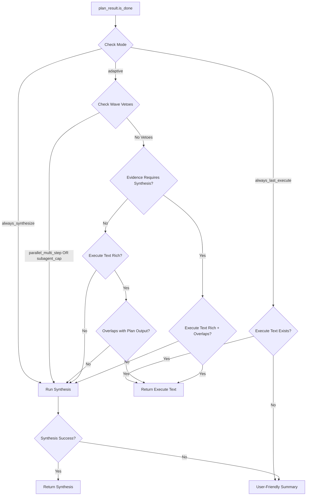

# Goal Completion Response Generation Workflow

> **RFC Reference**: RFC-204 (Consensus Loop), RFC-603 (Synthesis Phase), RFC-608 (Goal Lifecycle)
> **Implementation Guides**: IG-199 (Adaptive Final Response), IG-268 (Response Length Intelligence), IG-273 (Structural Richness)
> **Last Updated**: 2026-04-28

---

## Overview

The goal completion response generation workflow in Soothe is a multi-layer adaptive system that determines **when** to complete a goal and **how** to generate the final user response. This document analyzes the complete workflow from completion detection through response synthesis.

---

## Architecture Layers

Soothe uses a three-layer architecture for goal completion:

| Layer | Module | Role |
|-------|--------|------|
| **Layer 2** | `AgentLoop` (cognition/agent_loop) | Detects completion, generates response candidates |
| **Layer 3** | `GoalEngine` + `Consensus` (cognition/goal_engine) | Validates completion, manages goal lifecycle |
| **Interface** | `Runner` (core/runner) | Delivers final response to CLI/TUI |

---

## Workflow Stages

### Stage 1: Completion Detection (Plan Phase)

**Location**: `cognition/agent_loop/planner.py`

#### Primary Detection: LLM-Based Assessment

The Plan phase produces a `PlanResult` with:
- `status`: `"done"`, `"continue"`, or `"replan"`
- `goal_progress`: Estimated progress (0.0-1.0)
- `confidence`: Model confidence in assessment (0.0-1.0)
- `full_output`: Final user-visible answer when `status="done"`

**Progress Calculation Formula** (`planner.py:234-293`):

```python
progress = llm_progress * 0.6 + step_completion_ratio * 0.2 + evidence_growth_rate * 0.2
```

Where:
- `llm_progress`: Model's self-assessed progress (weighted 60%)
- `step_completion_ratio`: Ratio of successful steps (weighted 20%)
- `evidence_growth_rate`: Evidence accumulation rate (weighted 20%)

#### Fallback Detection: Action-Based Heuristics

When LLM fails to set `status="done"` despite clear completion signals, `_detect_completion_fallback()` (`planner.py:91-202`) forces completion based on:

**Completion Indicators** (≥2 required OR action repetition detected):

1. **Action Repetition**: Same action repeated across consecutive iterations
   ```python
   recent_actions = state.get_recent_actions(2)
   if actions_semantically_similar(action1, action2):
       completion_indicators.append("action_repetition")
   ```

2. **High Evidence Volume**: ≥10,000 chars with progress ≥0.8
   ```python
   if total_evidence_chars >= 10_000 and progress >= 0.8:
       completion_indicators.append("high_evidence_volume")
   ```

3. **Diminishing Returns**: Recent iterations added <10% new evidence
   ```python
   if recent_size < earlier_size * 0.1:
       completion_indicators.append("diminishing_returns")
   ```

4. **All Steps Successful**: All steps succeeded with substantial output (>5KB) and progress ≥0.85
   ```python
   if all_successful and has_substantial_output and progress >= 0.85:
       completion_indicators.append("all_steps_successful")
   ```

**Decision Logic**:
```python
if len(completion_indicators) >= 2 or "action_repetition" in completion_indicators:
    plan_result.status = "done"  # Force completion
```

---

### Stage 2: Response Length Determination (IG-268)

**Location**: `cognition/agent_loop/response_length_policy.py`

Before generating any response, the system determines the optimal response length category based on scenario analysis.

#### Response Length Categories

| Category | Word Count | Usage Scenario |
|----------|------------|----------------|
| **BRIEF** | 50-150 | Chitchat, quiz, simple questions |
| **CONCISE** | 150-300 | Thread continuation, simple follow-ups |
| **STANDARD** | 300-500 | Medium tasks, research synthesis |
| **COMPREHENSIVE** | 600-800 | Architecture analysis, complex implementation |

#### Determination Rules (`response_length_policy.py:50-124`)

```python
def determine_response_length(
    intent_type: str,          # chitchat/quiz/thread_continuation/new_goal
    goal_type: str,            # architecture_analysis/research_synthesis/implementation_summary/general
    task_complexity: str,      # chitchat/quiz/medium/complex
    evidence_volume: int,      # Total evidence char count
    evidence_diversity: int,    # Unique step types count
) -> ResponseLengthCategory:
```

**Priority Rules**:

1. **Intent Override**:
   - Chitchat/Quiz → BRIEF (always short replies)
   - Thread continuation → CONCISE (builds on prior context)

2. **Goal Type Specialization**:
   - Architecture analysis → COMPREHENSIVE (structured layers, components)
   - Implementation summary → COMPREHENSIVE (code patterns, examples)
   - Research synthesis + medium → STANDARD (methodology + findings)

3. **Task Complexity**:
   - Complex → COMPREHENSIVE
   - Medium → STANDARD

4. **Evidence Override** (volume + diversity):
   - Large evidence (≥2000 chars) + high diversity (≥4 steps) → COMPREHENSIVE
   - Moderate evidence (≥1000 chars) + diversity (≥3 steps) → STANDARD

#### Evidence Metrics Calculation

```python
def calculate_evidence_metrics(step_results: list) -> tuple[int, int]:
    successful_steps = [r for r in step_results if r.success]
    
    # Volume: Total character count from evidence strings
    evidence_volume = sum(len(r.to_evidence_string(truncate=False)) for r in successful_steps)
    
    # Diversity: Unique step types count
    evidence_diversity = len({r.step_id for r in successful_steps})
    
    return evidence_volume, evidence_diversity
```

---

### Stage 3: Adaptive Response Generation (IG-199)

**Location**: `cognition/agent_loop/agent_loop.py:330-529`

Once `plan_result.is_done()` returns true, the system chooses one of three generation branches based on evidence patterns and configuration.

#### Decision Tree



#### Branch 1: Direct Execute Response

**Condition**: `should_return_goal_completion_directly()` returns `True` (`final_response_policy.py:110-171`)

**Returns**: Last Execute-phase assistant text directly to user

**Eligibility Criteria** (adaptive mode):

1. **Configuration**: Not `always_synthesize` mode
2. **Wave Vetoes**: No parallel multi-step execution, no subagent cap hit
3. **Richness Check**: Execute text passes word count floor OR structured content
   ```python
   min_words = response_length_category.min_words  # IG-268 category
   if word_count(execute_text) >= min_words:
       return True  # Rich enough
   
   # Structural fallback (IG-273)
   if "```" in execute_text:  # Code blocks
       return True
   if len(non_empty_lines) >= 6:  # Multi-line payload
       return True
   ```
4. **Overlap Check**: Execute text shares content with planner's `full_output`
   ```python
   # Sample first 160 chars of planner output
   probe = plan_output[:160].lower()
   tokens = [t for t in split(r"\W+", probe) if len(t) >= 4]
   
   # Require ≥25% token overlap
   hits = sum(1 for t in tokens if t in execute_text.lower())
   return hits * 4 >= len(tokens)
   ```

**Implementation** (`agent_loop.py:405-411`):
```python
if direct_goal_completion:
    reuse = (state.last_execute_assistant_text or "").strip()
    final_output = reuse
    logger.info("Goal completion: branch=direct_execute assistant_chars=%d", len(reuse))
```

#### Branch 2: Goal Completion Synthesis

**Condition**: `needs_final_thread_synthesis()` returns `True` (`final_response_policy.py:77-108`)

**Triggers**:
- `always_synthesize` mode (config override)
- Wave-level vetoes (parallel multi-step, subagent cap)
- Evidence heuristics (`evidence_requires_final_synthesis()`)
- Missing Execute assistant text

**Evidence-Based Trigger** (`synthesis.py:30-58`):

All must be true:
1. ≥2 successful steps
2. ≥60% success rate
3. ≥500 chars total evidence
4. ≥2 unique step types

**Implementation** (`agent_loop.py:412-494`):

```python
# 1. Build synthesis request with length guidance
goal_completion_request = f"""Based on the complete execution history, generate a goal completion response.

RESPONSE LENGTH: {length_category.min_words}-{length_category.max_words} words ({length_category.value} category)

{self._get_length_guidance(length_category)}

The response should:
1. Summarize what was accomplished
2. **Include actual content** from tool results (ToolMessage.content)
3. Provide actionable results
4. Match the response length guidance
"""

# 2. Create special LoopHumanMessage with phase="goal_completion"
human_msg = LoopHumanMessage(
    content=goal_completion_request,
    thread_id=state.thread_id,
    iteration=state.iteration,
    phase="goal_completion",  # Special marker
)

# 3. Stream from CoreAgent with goal_completion_stream event type
accum = GoalCompletionAccumState()
async for chunk in self.core_agent.astream(
    {"messages": [human_msg]},
    stream_mode=["messages"],
):
    for msg in iter_messages_for_act_aggregation(chunk):
        update_goal_completion_from_message(accum, msg)
    
    # Yield special event type to bypass runner filtering
    yield ("goal_completion_stream", chunk)

# 4. Resolve accumulated text
final_output = resolve_goal_completion_text(accum)
```

**Streaming Accumulation** (`stream_chunk_normalize.py:142-191`):

```python
class GoalCompletionAccumState:
    accumulated_chunks: str = ""       # Concatenated AIMessageChunk text
    final_ai_message_text: str = ""    # Final AIMessage text
    ai_msg_count: int = 0

def resolve_goal_completion_text(state: GoalCompletionAccumState) -> str:
    # Prefer accumulated chunks over final message (handles sparse AIMessage)
    if len(state.accumulated_chunks) >= len(state.final_ai_message_text):
        return state.accumulated_chunks
    return state.final_ai_message_text
```

**Key Design**: Special `phase="goal_completion"` marker and `("goal_completion_stream", chunk)` event type ensure this response bypasses normal Runner filtering and reaches CLI/TUI unmodified.

#### Branch 3: User-Friendly Summary (Fallback)

**Condition**: Synthesis fails or no Execute text available

**Implementation** (`agent_loop.py:333-342`):

```python
# Generate user-friendly summary (NEVER leak verbose evidence_summary)
if plan_result.full_output:
    final_output = plan_result.full_output
elif state.step_results:
    successful_count = sum(1 for r in state.step_results if r.success)
    total_count = len(state.step_results)
    final_output = f"Completed {successful_count}/{total_count} steps successfully. {plan_result.next_action or ''}"
else:
    final_output = plan_result.next_action or "Goal achieved successfully"
```

**Critical Rule (IG-268)**: Never leak internal `evidence_summary` (verbose step strings) to users. Always generate user-friendly summary instead.

---

### Stage 4: Layer 3 Consensus Validation

**Location**: `cognition/goal_engine/consensus.py`

After AgentLoop produces `status="done"` response, Layer 3 validates the completion before accepting.

#### Validation Process

```python
async def evaluate_goal_completion(
    goal_description: str,
    response_text: str,         # AgentLoop's completion response
    evidence_summary: str = "",
    success_criteria: list[str] | None = None,
    model: BaseChatModel | None = None,
) -> tuple[ConsensusDecision, str]:
```

**Decision Types** (`consensus.py:22`):

| Decision | Action | Condition |
|----------|--------|-----------|
| **accept** | Mark goal completed | Goal truly satisfied |
| **send_back** | Return to AgentLoop with refined instructions | Goal not fully satisfied |
| **suspend** | Pause goal (budget exhaustion) | Cannot proceed further |

#### LLM-Based Evaluation

**Prompt Construction** (`consensus.py:129-165`):

```python
prompt = f"""Evaluate whether this goal completion truly satisfies the original goal.

GOAL: {goal_description}
RESPONSE: {response_text}
EVIDENCE: {evidence_summary}
SUCCESS CRITERIA: {success_criteria}

Decision options:
- accept: Goal is fully satisfied, response meets all criteria
- send_back: Goal not fully satisfied, need more work
- suspend: Cannot proceed further, budget exhausted

Provide your decision and reasoning in format:
DECISION: [accept/send_back/suspend]
REASONING: [explanation]
"""
```

#### Heuristic Fallback

When LLM unavailable (`consensus.py:87-126`):

```python
def _heuristic_evaluation(response_text, evidence_summary, success_criteria) -> tuple[ConsensusDecision, str]:
    # 1. Response length check
    if len(response_text) < 50:
        return "send_back", "Response too short"
    
    # 2. Success criteria keyword match
    if success_criteria:
        criteria_hits = sum(1 for c in success_criteria if c.lower() in response_text.lower())
        if criteria_hits < len(success_criteria) * 0.5:
            return "send_back", "Missing success criteria mentions"
    
    # 3. Default: Accept when response exists
    return "accept", "Response present, no LLM available to validate"
```

---

### Stage 5: Goal Lifecycle Management

**Location**: `cognition/goal_engine/engine.py`

#### Goal Completion Methods

**Complete Goal** (`engine.py:341-391`):

```python
async def complete_goal(self, goal_id: str, completion_response: str) -> None:
    """Mark goal as completed after Layer 3 validation.
    
    1. Update goal status to 'completed'
    2. Set completion_timestamp
    3. Store completion_response
    4. Update source file status (if from goal file)
    """
    goal = await self.get_goal(goal_id)
    goal.status = GoalStatus.COMPLETED
    goal.completion_response = completion_response
    goal.completion_timestamp = datetime.utcnow()
    
    # Update goal file if from managed source
    if goal.source_file:
        await self._update_goal_file_status(goal, "completed")
```

**Fail Goal** (`engine.py:393-510`):

```python
async def fail_goal(self, goal_id: str, error: str, evidence: EvidenceBundle) -> None:
    """Mark goal as failed with EvidenceBundle for Layer 3 review.
    
    1. Update goal status to 'failed'
    2. Store failure_reason and EvidenceBundle
    3. Apply backoff reasoning (incremental retry delays)
    4. Schedule retry if retry_count < max_retries
    """
    goal.status = GoalStatus.FAILED
    goal.failure_reason = error
    goal.evidence_bundle = evidence
    goal.retry_count += 1
    
    # Backoff reasoning: exponential delay with jitter
    backoff_delay = min(2 ** goal.retry_count, 3600)  # Cap at 1 hour
    await self._schedule_retry(goal_id, backoff_delay)
```

**Other Lifecycle Actions**:

- `validate_goal()`: Layer 3 accepted completion → status transition to `validated`
- `suspend_goal()`: Send-back budget exhaustion → status `suspended`
- `block_goal()`: Awaiting external input → status `blocked`
- `check_reactivated_goals()`: Auto-reactivate when dependencies resolved

---

## Key Design Principles

### 1. Evidence-Based Completion (RFC-204)

**Never rely solely on LLM self-assessment**:
- Combine LLM progress with execution metrics
- Use formula: `progress = 0.6 * llm + 0.2 * steps + 0.2 * evidence`
- Fallback detection when LLM misses clear signals

### 2. Adaptive Response Sizing (IG-268)

**Match response length to task complexity**:
- BRIEF for simple interactions (chitchat, quiz)
- CONCISE for thread continuation (builds on context)
- STANDARD for medium tasks (research synthesis)
- COMPREHENSIVE for complex work (architecture, implementation)

### 3. Three-Branch Response Generation (IG-199)

**Optimize for user experience and efficiency**:
- **Direct Execute**: Return when last Execute text is rich and aligned
- **Synthesis**: Generate when evidence requires consolidation
- **Fallback Summary**: Simple message when synthesis unavailable

### 4. Layer 3 Validation (RFC-204)

**Holistic evaluation before accepting completion**:
- AgentLoop's "done" judgment requires independent validation
- Consensus can send back for refinement or suspend when exhausted
- Prevents premature completion declaration

### 5. Never Leak Internal Evidence (IG-268)

**User-friendly summaries only**:
- `evidence_summary` contains verbose step strings (for internal use)
- Always generate user-friendly summary for fallback
- Direct Execute and Synthesis handle content presentation properly

---

## Configuration Options

### Final Response Mode (`config.yml`)

```yaml
agentic:
  final_response: adaptive  # Options: adaptive, always_synthesize, always_last_execute
```

**Modes**:

| Mode | Behavior |
|------|----------|
| **adaptive** | Use heuristics to choose optimal branch (default) |
| **always_synthesize** | Always run synthesis phase (for complex workflows) |
| **always_last_execute** | Always return last Execute text when available |

### Response Length Override

```yaml
agentic:
  response_length_override: comprehensive  # Override automatic categorization
```

---

## Events

### Goal Completion Events

| Event | Type | Trigger |
|-------|------|---------|
| `GoalCompletedEvent` | `soothe.cognition.goal.completed` | Goal marked completed |
| `GoalFailedEvent` | `soothe.cognition.goal.failed` | Goal marked failed (includes retry_count) |
| `GoalReportEvent` | `soothe.cognition.goal.report` | Step counts and summary |
| `LoopAgentReasonEvent` | `soothe.cognition.agent_loop.reason` | User-visible progress after Plan phase |

### Streaming Events

| Event Type | Payload | Usage |
|------------|---------|-------|
| `("goal_completion_stream", chunk)` | Stream chunk from CoreAgent synthesis | Bypasses Runner filtering, reaches CLI/TUI directly |
| `("completed", {"result": PlanResult, "step_results_count": int})` | Completion metadata | Runner finalizes goal lifecycle |

---

## Code References

### Key Classes

| Class | Location | Purpose |
|-------|----------|---------|
| `AgentLoop` | `cognition/agent_loop/agent_loop.py:47` | Plan-Execute orchestration |
| `LLMPlanner` | `cognition/agent_loop/planner.py:304` | Two-call Plan architecture |
| `PlanResult` | `cognition/agent_loop/schemas.py:93` | Plan phase output with reasoning chain |
| `StatusAssessment` | `cognition/agent_loop/schemas.py:157` | Lightweight status check |
| `GoalCompletionAccumState` | `cognition/agent_loop/stream_chunk_normalize.py:142` | Streaming accumulator |
| `GoalEngine` | `cognition/goal_engine/engine.py:29` | Goal lifecycle manager with DAG scheduling |
| `EvidenceBundle` | `cognition/goal_engine/models.py:70` | Layer 2 → Layer 3 evidence exchange |

### Key Functions

| Function | Location | Purpose |
|----------|----------|---------|
| `should_return_goal_completion_directly()` | `final_response_policy.py:110` | Check Execute text eligibility |
| `needs_final_thread_synthesis()` | `final_response_policy.py:77` | Determine synthesis need |
| `determine_response_length()` | `response_length_policy.py:50` | Calculate response category |
| `evidence_requires_final_synthesis()` | `synthesis.py:30` | Evidence-based trigger check |
| `evaluate_goal_completion()` | `consensus.py:25` | Layer 3 validation |
| `_detect_completion_fallback()` | `planner.py:91` | Force completion detection |

---

## Testing

### Test Locations

| Test Type | Location |
|-----------|----------|
| **Plan Phase Completion** | `packages/soothe/tests/unit/cognition/agent_loop/test_planner.py` |
| **Response Policy** | `packages/soothe/tests/unit/cognition/agent_loop/test_final_response_policy.py` |
| **Response Length** | `packages/soothe/tests/unit/cognition/agent_loop/test_response_length_policy.py` |
| **Consensus Validation** | `packages/soothe/tests/unit/cognition/goal_engine/test_consensus.py` |
| **Goal Lifecycle** | `packages/soothe/tests/integration/cognition/goal_engine/test_goal_lifecycle.py` |

### Verification Command

```bash
./scripts/verify_finally.sh
```

Runs:
- Code formatting check
- Linting (zero errors required)
- Unit tests (900+ tests must pass)

---

## Future Enhancements

### Planned Improvements (RFCs)

1. **Multi-Goal Completion**: Handle completion of multiple concurrent goals
2. **Completion Metrics**: Track completion time, iteration count, success rate per goal type
3. **Adaptive Backoff**: Learn from failure patterns to optimize retry delays
4. **User Feedback Integration**: Accept explicit user feedback on completion quality

---

## References

### RFC Documents

- **RFC-204**: Consensus Loop for Layer 3 Validation
- **RFC-603**: Synthesis Phase for Comprehensive Reports
- **RFC-608**: Goal Lifecycle Management

### Implementation Guides

- **IG-199**: Adaptive Final Response Policy
- **IG-268**: Response Length Intelligence System
- **IG-273**: Structural Richness Check for Direct Execute

### Related Documentation

- **Debug Guide**: `docs/howto_debug.md` - LLM tracing, goal completion auditing
- **User Guide**: `docs/user_guide.md` - Response quality tuning
- **Architecture**: `docs/specs/RFC-000-system-conceptual-design.md`

---

## Summary

The goal completion response generation workflow in Soothe is a sophisticated adaptive system with:

1. **Evidence-based completion detection** combining LLM assessment with execution metrics
2. **Three-branch response generation** optimizing for user experience and efficiency
3. **Response length intelligence** matching output size to task complexity
4. **Layer 3 validation** ensuring goal satisfaction before accepting completion
5. **Comprehensive lifecycle management** handling completion, failure, retry, and reactivation

This architecture ensures goals complete reliably with user-appropriate responses, validated independently to prevent premature completion while maintaining efficiency through adaptive response sizing.