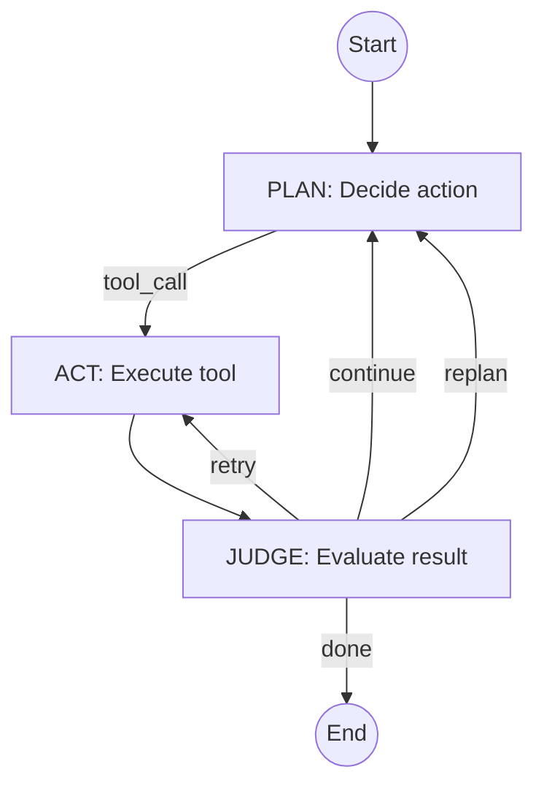
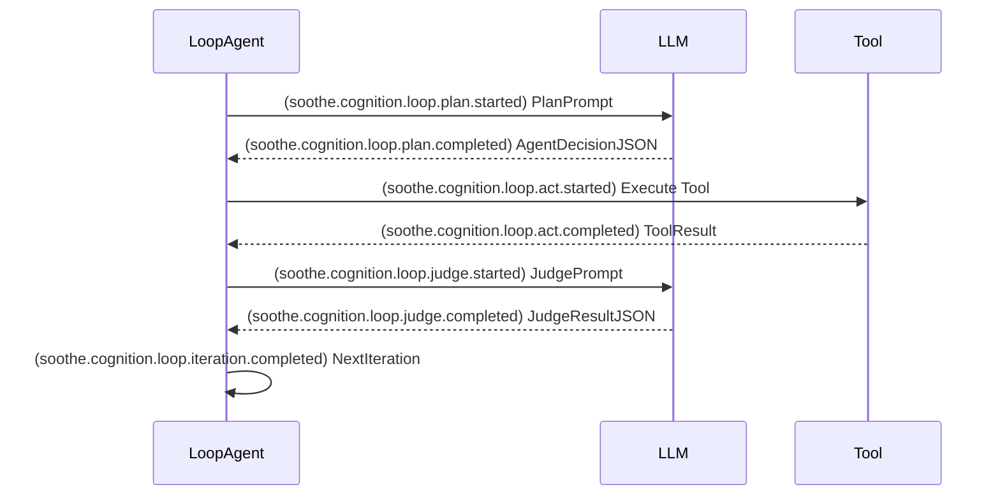

# Executive Summary

We propose a revised **RFC-0008** to define a **Claude-CLI-style agent loop** (named **LoopAgent**) built on the DeepAgents framework. The goal is to design a *deterministic control loop* where the LLM plans actions, the system executes tools, and then the LLM judges results in a cycle. Key improvements include an explicit **PLAN→ACT→JUDGE** sequence, structured tool I/O, robust guardrails, and observability through events (`soothe.cognition.loop.*`). We **do not design memory here** (memory is handled by a separate MemAgent; memory requirements are noted but implementation is out of scope). Unspecified items from project attachments (assumed to include the original RFC-0008, architecture diagram, and event spec) are explicitly marked. This RFC draft provides detailed interface schemas, control-flow pseudocode, example prompts, and a development plan. All sections are backed by relevant references (Anthropic and DeepAgents docs) to guide implementation and review.

## 1. Goals & Scope

- **Objective**: Redesign RFC-0008 into an interactive, Claude-like **LoopAgent** execution loop using the DeepAgents library. The LoopAgent should iteratively **plan** the next step with the LLM, **execute** tools, then **judge** the outcomes until the task is complete or a guardrail is hit.  
- **Scope**: Covers micro-level loop behavior. Includes decision schemas, tool interface conventions, judge prompts, events, and safety mechanisms. Excludes macro-planning (handled by a higher-level PlanAgent/RFC-0007) and detailed memory design (marked *unspecified*, assumed handled elsewhere【26†L103-L106】).  
- **Attachments Assumed**: Original RFC-0008 draft, system architecture diagrams, and event specifications. Any missing details (e.g. concurrency model, exact tool APIs) are explicitly noted as *“unspecified”* below.  

## 2. Design Principles

- **Explicit Control Layer**: The LoopAgent’s control flow (Observe → Plan → Act → Judge → Repeat) is managed by code, not by implicit LLM tricks. We separate planning from execution to keep the agent deterministic. As noted by Claude’s docs, each agent turn is a clear loop of prompt→tool calls→responses【31†L230-L233】.  
- **Judge as First-Class**: After each tool execution, the LLM must evaluate whether the result advances the goal. The Judge step outputs a structured decision (continue/retry/replan/done). This avoids blind tool-chaining. (Anthropic emphasizes the agent as an open-ended loop, not a fixed workflow【13†L108-L114】.)  
- **Layered Memory (unspecified)**: We acknowledge the need for short-term and long-term memory. DeepAgents CLI, for example, retains persistent memory across sessions【26†L103-L106】. However, **LoopAgent does not implement memory**; memory use is handled by a separate MemAgent (out of scope).  
- **Structured Tool I/O**: Every tool must return structured JSON (fields like `success/data/error`). This avoids ambiguity and hallucination. Tools act like *deterministic functions*【29†L55-L63】, meaning same input always yields same output. We enforce JSON schemas for inputs/outputs.  
- **Guardrails & Safety**: Apply strict limits and checks. We include **max-steps, max-retries, and repeat-detection** to prevent infinite loops. Errors and hallucinations are caught explicitly. (Claude’s SDK, for example, caps turns with `max_turns`【31†L298-L302】.)  
- **Observability**: Emit detailed events (with prefix `soothe.cognition.loop.`) at each stage (plan, act, judge). Log key fields (goal, step, decision, result, judgment). This ensures traceability and supports debugging via tools like LangSmith【26†L129-L132】.  
- **Interruptibility**: The loop must respond to external signals (e.g. user abort). On interrupt, the agent should emit a termination event and cleanly stop.  
- **Optional Streaming**: Support token-by-token streaming of LLM “thoughts” or incremental execution if desired (e.g. for CLI UX), but make it configurable. DeepAgents CLI supports streaming modes, so we align with that capability.

## 3. Interfaces & Data Models

We define strict JSON/Pydantic schemas for all key interactions. Examples and field semantics are given below.

### 3.1 Plan Decision Schema

The LoopAgent’s LLM output on each iteration is an `AgentDecision` (in JSON). Example (Pydantic model):

```python
from typing import Literal, Dict, Any
from pydantic import BaseModel

class AgentDecision(BaseModel):
    type: Literal["tool", "final"]
    tool: Optional[str] = None
    args: Optional[Dict[str, Any]] = None
    reasoning: str
    answer: Optional[str] = None
```

| Field     | Type                        | Description                                     |
|-----------|-----------------------------|-------------------------------------------------|
| `type`    | `"tool"` or `"final"`       | If `"tool"`, call a tool; if `"final"`, finish with `answer`. |
| `tool`    | String (if `type="tool"`)   | Name of the tool to invoke (registered in DeepAgents). |
| `args`    | Object (if `type="tool"`)   | Arguments for the tool (must match tool’s schema). |
| `reasoning`| String                     | LLM’s rationale for this decision (for logging). |
| `answer`  | String (if `type="final"`)  | Final text answer (when type is `"final"`).      |

### 3.2 Judge Result Schema

After tool execution, the LLM returns a `JudgeResult` to guide the loop.

```python
class JudgeResult(BaseModel):
    status: Literal["continue", "retry", "replan", "done"]
    reason: str
    next_hint: Optional[str] = None
    final_answer: Optional[str] = None
    confidence: Optional[float] = None
```

| Field         | Type                         | Description                                               |
|---------------|------------------------------|-----------------------------------------------------------|
| `status`      | `"continue"|"retry"|"replan"|"done"` | Action after judge: keep going, retry step, replan strategy, or finish. |
| `reason`      | String                       | Explanation for the judgment (for logs/metrics).           |
| `next_hint`   | String (optional)            | If retrying, a hint or correction for the next attempt.   |
| `final_answer`| String (if `done`)           | If status is `"done"`, the final answer to return.         |
| `confidence`  | Float (0.0–1.0, optional)    | Judge’s confidence score (e.g. 0.0–1.0) for the decision.  |

### 3.3 Tool Output Schema

All tools follow a uniform output model:

```python
class ToolOutput(BaseModel):
    success: bool
    data: Any
    error: Optional[str] = None
```

| Field    | Type              | Description                                |
|----------|-------------------|--------------------------------------------|
| `success`| Boolean           | Whether the tool executed successfully.    |
| `data`   | Any (JSON)        | Result data (structure depends on tool).   |
| `error`  | String (optional) | Error message if `success=false`.          |

This ensures LoopAgent can reliably inspect each tool’s result. A deterministic tool should always produce the same `data` given the same args【29†L55-L63】.

### 3.4 Loop State & History

We maintain a `LoopState` to capture progress (non-persistent, per-run):

```python
class LoopState(BaseModel):
    goal: str
    iteration: int
    history: List[Dict[str, Any]]
    plan: Optional[Any] = None   # (If a high-level plan is used, else None)
```

- `goal`: The task description.
- `iteration`: Current loop iteration count.
- `history`: List of records per step (see below).
- `plan`: (Optional) high-level plan or DAG node info (unspecified in LoopAgent).

Each history entry is a `StepRecord`:

```python
# Example StepRecord entry (not a class in code, just a JSON structure)
{
  "step": int,
  "decision": AgentDecision,
  "result": ToolOutput,
  "judgment": JudgeResult
}
```

| Field     | Type              | Description                     |
|-----------|-------------------|---------------------------------|
| `step`    | Integer           | Iteration number.               |
| `decision`| AgentDecision JSON| The LLM’s decision at this step.|
| `result`  | ToolOutput JSON   | The result from the tool call.  |
| `judgment`| JudgeResult JSON  | The LLM’s judgment this step.   |

These data models provide clear contracts. Inputs must be validated against schemas before use. For example, DeepAgents can leverage Pydantic or JSON Schema to enforce tool args and outputs. 

## 4. Control Flow & State Machine

The LoopAgent executes the following cycle until completion:

1. **Observe**: Gather context (user goal, history, external memory).  
2. **Plan**: Call LLM to produce an `AgentDecision`.  
3. **Act**: If `type="tool"`, execute the specified tool with provided args.  
4. **Judge**: Pass goal, decision, and tool result to LLM to get a `JudgeResult`.  
5. **Update**: Append decision/result/judgment to history, increment iteration.  
6. **Loop or End**: Based on `JudgeResult.status`, either stop or loop:
   - `"done"` → return `final_answer`.  
   - `"retry"` → adjust inputs (see guardrail below) and go to Act again.  
   - `"replan"` → optionally trigger a higher-level plan change, then continue.  
   - `"continue"` → proceed to next iteration normally.

**Pseudocode (conceptual)**:

```python
state = LoopState(goal=user_goal, iteration=0, history=[])
while state.iteration < max_iterations:
    context = assemble_context(state)  # from state and (unspecified) memory
    
    decision = LLM.plan(context)   # returns AgentDecision
    if decision.type == "final":
        return decision.answer
    
    result = execute_tool(decision.tool, decision.args)
    
    judgment = LLM.judge(context, decision, result)  # returns JudgeResult
    
    # Record step
    state.history.append({"step": state.iteration, 
                          "decision": decision.dict(), 
                          "result": result.dict(), 
                          "judgment": judgment.dict()})
    state.iteration += 1
    
    if judgment.status == "done":
        return judgment.final_answer
    if judgment.status == "retry":
        # e.g. refine args and re-execute (not advancing step count)
        decision.args = refine_args(decision.args, judgment.next_hint)
        continue
    if judgment.status == "replan":
        # e.g. trigger a new high-level plan (out of scope here)
        continue
    # status == "continue": loop to next iteration
```

### Mermaid Flowchart



This chart shows the LoopAgent’s core cycle.  The `retry` branch allows re-running the same decision (with modifications); `replan` would switch strategy (e.g. new subtask). We do **not** cover concurrency here (unspecified): this loop is single-threaded. (DeepAgents itself can support sub-agents via a `task` tool, but that is outside LoopAgent’s scope.)

### Guardrails & Limits

- **Max iterations**: e.g. `max_iterations=50`. If exceeded, emit an abort event. (DeepAgents CLI uses `max_turns`【31†L298-L302】.)  
- **Max retries**: e.g. if `status="retry"` occurs >3 times on the same step, abort that loop.  
- **Repeat-action detection**: Track last N decisions; if the same tool is called with identical args repeatedly, assume stuck.  
- **Error triggers**: If a tool raises an exception or returns invalid schema, treat as `success=false` and have Judge handle it (often as retry/replan).  
- **Timeouts**: Each step (LLM or tool call) should have a timeout. On timeout, set `error` and trigger a retry or safe abort.  
- **Logging/Alerting**: On any guardrail trip, emit a `soothe.cognition.loop.error` event with details for monitoring.

## 5. DeepAgents Integration

DeepAgents supplies the execution harness; our LoopAgent is the **orchestration layer**. Roles:

| Component                   | Handled by DeepAgents                | Handled by LoopAgent (Runner)           |
|-----------------------------|--------------------------------------|-----------------------------------------|
| **LLM Calls**               | Provides LLM API and model config    | Build prompts for plan/judge, parse JSON|
| **Tool Abstraction**        | Tool interface, schema validation    | Register specific tools, call them      |
| **Memory/Context Backend**  | File-based and long-term memory store【26†L103-L106】 | Include memory context in prompts (details out of scope) |
| **Event/Tracing Hooks**     | Emits low-level LangSmith trace events (calls, usage)【26†L129-L132】 | Emit custom `soothe.cognition.loop.*` events |
| **Loop Logic**              | No (DeepAgents CLI has its own loop) | Main plan-act-judge loop control        |
| **Concurrency**             | Supports subagents (`task` tool)     | Not implemented (unspecified)           |

DeepAgents provides the `create_deep_agent` API, tool registration decorators, and optional memory backends【26†L103-L106】. However, to implement a custom loop, we **bypass its default loop** and drive calls manually. For example (Python-like pseudocode):

```python
from deepagents import create_deep_agent, Tool

# Define tools
class SearchTool(Tool):
    name = "search"
    description = "Search the web"
    def run(self, query: str) -> dict:
        # ... implementation ...
        return {"results": ["result1", "result2"]}

# Initialize agent harness
agent = create_deep_agent(model="anthropic:claude-2", tools=[SearchTool()])

class LoopAgent:
    def __init__(self, agent_harness):
        self.agent = agent_harness

    async def run(self, goal: str):
        state = LoopState(goal=goal, iteration=0, history=[])
        # Optionally invoke a high-level plan (omitted, unspecified)
        while True:
            # PLAN step
            prompt = build_plan_prompt(state)
            emit_event("soothe.cognition.loop.plan.started", goal=goal, step=state.iteration)
            plan_resp = await self.agent.invoke_llm({"prompt": prompt})
            emit_event("soothe.cognition.loop.plan.completed", output=plan_resp)
            decision = AgentDecision.model_validate_json(plan_resp)

            if decision.type == "final":
                return decision.answer

            # ACT step
            emit_event("soothe.cognition.loop.act.started", tool=decision.tool)
            tool_output = await self.agent.execute_tool(decision.tool, decision.args)
            emit_event("soothe.cognition.loop.act.completed", result=tool_output)
            
            # JUDGE step
            judge_prompt = build_judge_prompt(state.goal, decision, tool_output)
            emit_event("soothe.cognition.loop.judge.started")
            judge_resp = await self.agent.invoke_llm({"prompt": judge_prompt})
            emit_event("soothe.cognition.loop.judge.completed", output=judge_resp)
            judge = JudgeResult.model_validate_json(judge_resp)
            
            # Update history
            state.history.append({
                "step": state.iteration,
                "decision": decision.dict(),
                "result": tool_output,
                "judgment": judge.dict()
            })
            state.iteration += 1
            
            # Check status
            if judge.status == "done":
                emit_event("soothe.cognition.loop.finished", answer=judge.final_answer)
                return judge.final_answer
            if judge.status == "retry":
                continue
            if judge.status == "replan":
                # handle replan if needed (unspecified)
                continue

            # default: continue loop
```

In this skeleton, `invoke_llm` abstracts the DeepAgents LLM call. Events (`soothe.cognition.loop.*`) are emitted around each stage for observability. The `execute_tool` method runs the tool by name (DeepAgents handles input schema and execution).

### Mapping Table

| Responsibility             | DeepAgents Library                      | LoopAgent Runner (this RFC)            |
|----------------------------|-----------------------------------------|-----------------------------------------|
| LLM Communication          | `invoke_llm` API, streaming modes【31†L230-L233】 | Crafting prompts for plan/judge, parsing JSON results |
| Tools                      | Tool registration (`Tool` class), schema enforcement | Calling selected tool with args, handling output |
| Memory/Context             | Persistent memory store (LangGraph)【26†L103-L106】 | Include retrieved memory in prompt (design unspecified) |
| Planning (macro)           | (Not provided by DeepAgents)           | High-level planning (via separate PlanAgent) |
| Execution Loop Logic       | (Not provided if bypassed)             | Orchestrates Plan→Act→Judge sequence    |
| Events/Tracing             | Low-level traces (LangSmith)【26†L129-L132】  | Custom events `soothe.cognition.loop.*` for each phase |
| Concurrency / Subagents    | Supports via `task` tool【26†L119-L124】   | Out-of-scope for this loop (unspecified) |

## 6. Judge Prompt Engineering and Example

The **Judge** prompt must coerce the LLM to output strict JSON. A typical template (in English) is:

```
You are the judge for the agent’s action. 
Goal: {state.goal}
Action taken: {decision}
Result: {result}

Decide whether the agent should continue, retry, replan, or finish. 
Output a JSON object with:
- status: "continue"/"retry"/"replan"/"done"
- reason: explanation text
- next_hint: (optional) hint for retry
- final_answer: (if done)

Example:
If the result achieves the goal, set status="done" and provide answer.
If not, use "continue" or "retry" with a reason.
```

**Output constraints**: The JSON keys must match the `JudgeResult` schema exactly, with no extra fields. For example:

```json
{
  "status": "continue",
  "reason": "Tool call succeeded but more steps needed",
  "next_hint": null,
  "final_answer": null,
  "confidence": 0.9
}
```

Below is an **example interaction** (3 steps) demonstrating `Plan→Act→Judge→Replan`:

- **Goal**: *"List the three largest cities in France."*

  **Iteration 1**:  
  - *Plan*→ (to LLM): 
    ```json
    {"type":"tool","tool":"search","args":{"query":"largest cities in France"}}
    ```  
  - *Act*→ search tool returns:
    ```json
    {"success": true, "data": ["Paris","Marseille","Lyon"], "error": null}
    ```  
  - *Judge*→ LLM returns:
    ```json
    {"status":"done",
     "reason":"Found top 3 cities as requested",
     "next_hint":null,
     "final_answer":"The three largest cities in France are Paris, Marseille, and Lyon.",
     "confidence":0.93}
    ```
  - Loop terminates (status=`done`).

- **Goal**: *"What's the capital of Norway, in uppercase?"* (demonstrates continue and final)

  **Iteration 1**:  
  - *Plan*: `{"type":"tool","tool":"search","args":{"query":"capital of Norway"}}`  
  - *Act*: returns `{"success": true, "data": ["Oslo"], "error": null}`.  
  - *Judge*: returns `{"status":"continue","reason":"Capital found, need uppercase","next_hint":null,"final_answer":null,"confidence":0.85}`.

  **Iteration 2**:  
  - *Plan*: `{"type":"tool","tool":"transform","args":{"text":"Oslo","operation":"uppercase"}}`  
  - *Act*: returns `{"success": true, "data": ["OSLO"], "error": null}`.  
  - *Judge*: returns `{"status":"done","reason":"Converted to uppercase","next_hint":null,"final_answer":"OSLO","confidence":0.90}`.  
  - Loop ends with answer **"OSLO"**.

This shows the agent chaining tools under LoopAgent control. The Judge prompts guide next steps and enforce JSON output.

## 7. Tool Design Specification

Tools invoked by LoopAgent must follow strict rules:

- **Structured Return**: Always return a JSON object (as per `ToolOutput`). Never freeform text.  
- **Schema Validation**: Define input/output JSON schemas (use Pydantic or JSON Schema). Validate args before calling and results after returning.  
- **Timeouts**: Enforce a hard timeout on tool execution. On timeout, return `{"success":false,"data":null,"error":"timeout"}`.  
- **Error Classification**: Distinguish error types (network failure, invalid input, etc.) in the `error` field, so the judge can decide to retry or abort.  
- **Idempotency**: Design tools so that repeated calls with same args have consistent outputs. If full determinism isn’t possible, document side-effects and handle retries carefully.  
- **Examples**:

  ```python
  class WeatherTool(Tool):
      name = "get_weather"
      description = "Return weather for a given city."
      def run(self, city: str) -> dict:
          try:
              w = external_api.get_weather(city)
              return {"success": True, "data": {"temperature": w.temp, "condition": w.desc}, "error": None}
          except Exception as e:
              return {"success": False, "data": None, "error": str(e)}
  ```

Each tool’s docstring or metadata should mention reliability. (As Anthropic notes, tools should feel “ergonomic” to the agent【29†L55-L63】.)

## 8. Guardrails & Safety

To prevent failures:

- **Max Steps**: Set `max_iterations` (e.g. 50). If reached without `done`, emit `soothe.cognition.loop.error` and stop.  
- **Max Retries**: Cap consecutive `"retry"` occurrences (e.g. 3 retries per step).  
- **Repeat Detection**: If the last 3 decisions called the same tool with same args, assume stuck and abort.  
- **Tool Hallucination**: If a tool’s output fails schema or logical checks (e.g. nonsensical data), treat it as `success=false`. The judge can then instruct a retry or alternative tool.  
- **Silent Failures**: If a tool returns success=true but `data` is empty/invalid, the Judge should flag it. We may include an automatic check that `ToolOutput.success` = False when data is clearly wrong.  
- **Monitoring/Alerts**: Critical events (loop termination, repeated failures) should log errors. Metrics (below) include tool error counts and loop abort rate for alerting.

## 9. Events & Observability

We define new events with prefix `soothe.cognition.loop.` for observability. Key events:

- `soothe.cognition.loop.plan.started` / `.completed`: Emitted before/after sending the Plan prompt. Log fields: `goal`, `step`, `prompt`.
- `soothe.cognition.loop.act.started` / `.completed`: Before/after executing a tool. Fields: `tool`, `args`, `result`.
- `soothe.cognition.loop.judge.started` / `.completed`: Before/after sending Judge prompt. Fields: `decision`, `result`, `judgment`.
- `soothe.cognition.loop.iteration.completed`: After each loop iteration. Fields: `step`, maybe summary of change.
- `soothe.cognition.loop.finished`: When loop ends successfully. Fields: `answer`, `steps`.
- `soothe.cognition.loop.error`: On guardrail abort or exception. Fields: `reason`, `step`.

**Log Fields**: Each event should include context fields like `agent_id`, `goal`, `step`, plus event-specific data (see above). Use structured logging (JSON) for easy querying.

**Metrics** to collect:
- **Iteration Count** vs **Goal Complexity**: measure how many loops typical tasks take. Plot as a line graph over tasks.  
- **Judge Overhead Ratio**: Percentage of time/steps spent in Judge vs total.  
- **Tool Success Rate**: (#successful tool calls) / (total tool calls). Display as a pie chart (success vs failures).  
- **Status Distribution**: Frequency of each `JudgeResult.status`. Could use a bar chart.
  
**Visualization**:  
- Line charts of iteration count per task index.  
- Pie or bar charts of loop outcomes and tool error types.  
- Sequence diagrams (Mermaid) for runtime flows. For example:



This shows the interplay of events and actions in one iteration.

## 10. Performance & Evaluation

We should evaluate LoopAgent on representative tasks, measuring:

- **Task Success**: correctness of final answers.  
- **Iterations & Tool Calls**: how many loops and tools per task (lower is generally better).  
- **Latency**: time per loop and total runtime.  
- **Resource Usage**: tokens consumed, API calls.  
- **Judge Accuracy**: how often Judge decisions lead to eventual success (could test with ground-truth tasks).  

**Benchmark Scenarios**:  
1. **Simple Queries** (few tool calls).  
2. **Multi-step Tasks** (e.g. data aggregation requiring several tools).  
3. **Edge Cases** (challenging prompts, invalid inputs).  

Collect metrics such as total runtime, tool call count, token usage and errors【29†L189-L193】. Use sampling of real-world prompts. Evaluate against previous RFC-0008 (if implemented) or a baseline (like DeepAgents CLI in non-Loop mode). Automated tests and logs should capture the above metrics.  

We also recommend **human-in-the-loop evaluations** for subjective quality, and use LLM-judges for scoring answer accuracy as suggested in Anthropic tooling guidelines【29†L189-L193】.

## 11. Migration & Compatibility

- **Differences from original RFC-0008**: The new design adds an explicit Judge phase, structured schemas, and loop control. Original RFC-0008 (“Observe→Act→Verify”) is now formalized as a Plan/Act/Judge cycle. Decision/result schemas are now JSON-typed. Events and configuration parameters are updated.  
- **Relation to RFC-0007**: RFC-0007 covers high-level goal decomposition (DAG). Here, LoopAgent operates at each DAG node. In integration, a PlanAgent (RFC-0007) may provide a node goal to LoopAgent, which then executes the loop.  
- **Backward Compatibility**: Existing components that consume agent output need minimal changes:  
  - Final answers are still delivered as text.  
  - New event names (`soothe.cognition.loop.*`) should not conflict with old events.  
  - If older code expected an “observation” step, this is now implicit in the loop.  
  - Tools remain the same; just ensure any new fields (`reasoning`, `confidence`) are optional.  

Overall, we do not anticipate breaking external integrations, as the public interfaces (tool calls, final answer API) remain conceptually similar, though enriched by extra metadata.

## 12. Implementation Plan & Deliverables

We propose an iterative development plan:

| Milestone                   | Deliverable (Artifacts)                                       | Acceptance Criteria                          | Owner | Est. Hours |
|-----------------------------|-------------------------------------------------------------|---------------------------------------------|-------|-----------|
| **1. Spec Finalization**     | Revised RFC-0008 draft (text, diagrams, JSON schemas)       | Draft reviewed by team; interfaces agreed    |       | 16        |
| **2. Core Loop Implementation** | `LoopAgent` class (Plan/Act/Judge loop code)             | Unit tests for loop logic pass; example runs |       | 60        |
| **3. Tool & Judge Integration** | Sample tools (with JSON schema), Judge prompt templates   | Tools execute and return JSON; judge output validated |       | 40        |
| **4. Events & Observability** | Event emitters added (`soothe.cognition.loop.*`), logging | Events logged correctly at each phase; traceable in LangSmith |       | 24        |
| **5. Testing & Safety**      | Automated tests (including guardrail cases), metrics scripts | No infinite loops; guardrails trigger as expected |       | 30        |
| **6. Documentation & Review** | Final RFC doc, code comments, usage guide                 | Documentation updated; peer review passed    |       | 20        |

*Owners* are TBD by the team. Hour estimates assume a single skilled developer; adjust as needed. Progress should be tracked in sprints, with code reviews and acceptance testing at each milestone.

## Appendix

- **Sample Code Snippets**: See sections above (LoopAgent pseudocode, Tool example).  
- **JSON Schemas**: See section 3 for data models.  
- **Mermaid Chart Sources**: Provided inline above for flowchart and sequence diagrams.  
- **References (in priority)**: DeepAgents docs【26†L103-L106】【26†L119-L124】, Anthropic Claude agent docs【31†L230-L233】【31†L272-L279】, Anthropic tool guidelines【29†L55-L63】【29†L189-L193】, Steve Kinney agent loop analysis, etc. These informed our design decisions.  

