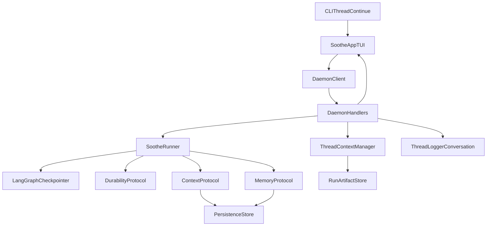
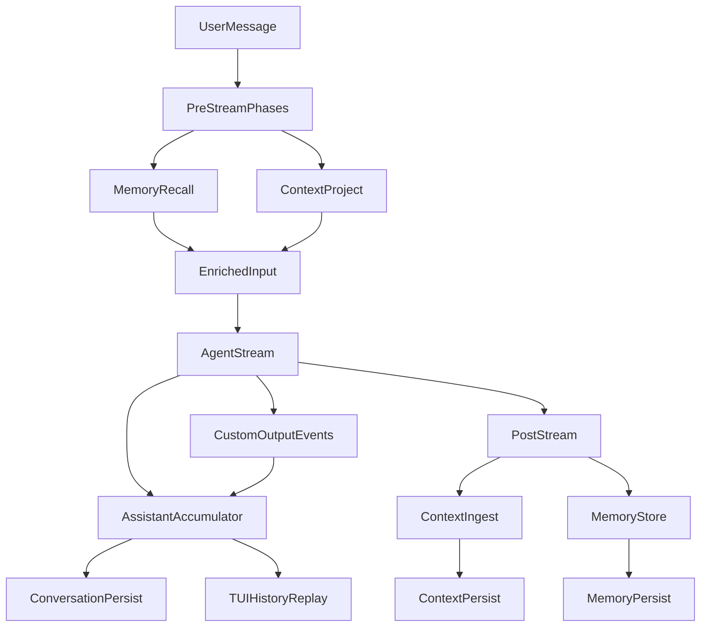

# IG-049: RFC-402 Thread Resume History Recovery

## Summary

This guide closes RFC-402 gaps in thread resume behavior for `soothe thread continue <thread_id>`.
The target outcome is consistent chat history recovery where both user and assistant turns are available
after resume in daemon-backed TUI sessions.

## Problem Statement

Observed behavior:

- Resumed threads can show user turns, but assistant turns are missing.
- Some threads have full execution artifacts and checkpoints but incomplete conversation replay.

Root causes:

1. Resume path in daemon message handling sets runner thread id directly and does not route through
   `ThreadContextManager.resume_thread()`.
2. Daemon assistant persistence only captures `messages` stream text accumulation; assistant text emitted
   via `soothe.output.*` custom events is not always persisted as `conversation` records.
3. TUI history loader replays only `conversation` records, so assistant output present as `event` records
   is not reconstructed in chat view.

## RFC-402 Mapping

- RFC-402 requires a unified thread coordinator (`ThreadContextManager`) to handle resume operations.
- RFC-402 resume flow expects full history loading behavior on thread continuation.
- RFC-402 storage model spans durability/checkpointer/thread logger/artifacts and must degrade gracefully.

## Scope

In scope:

- Daemon resume routing via `ThreadContextManager`.
- Daemon assistant output persistence for custom output events.
- TUI history replay fallback reconstruction from output events.
- Regression tests for above behavior.

Out of scope:

- Reworking checkpointer storage format.
- Migration tooling for old logs beyond best-effort replay fallback.

## Architecture And Message Paths

## Message Lifecycle Through Context And Memory

## Implementation Plan

1. Route daemon `resume_thread` handling through `ThreadContextManager.resume_thread(thread_id)`.
2. In daemon query execution, aggregate assistant content from:
   - `messages` mode AI text extraction,
   - `custom` mode events: `soothe.output.chitchat.response`, `soothe.output.autonomous.final_report`.
3. Persist assistant content once per completed query via `ThreadLogger.log_assistant_response(...)`.
4. In TUI `_load_thread_history`, keep `conversation` replay as primary source and add fallback reconstruction
   from output event records when assistant conversation turns are absent.
5. Add unit tests for daemon persistence path, resume coordinator routing, and fallback replay behavior.

## Compatibility Notes

- Existing conversation logs remain valid.
- For threads with only output events and no assistant conversation records, replay fallback recovers display.
- New behavior is additive and does not change user-facing command syntax.

## Validation

- Unit tests:
  - daemon resume routing test,
  - daemon assistant persistence from custom output events,
  - TUI history replay fallback test.
- Smoke test:
  1. Run a chitchat/final-report-producing thread.
  2. Resume with `uv run soothe thread continue <thread_id>`.
  3. Verify user and assistant turns are present.

