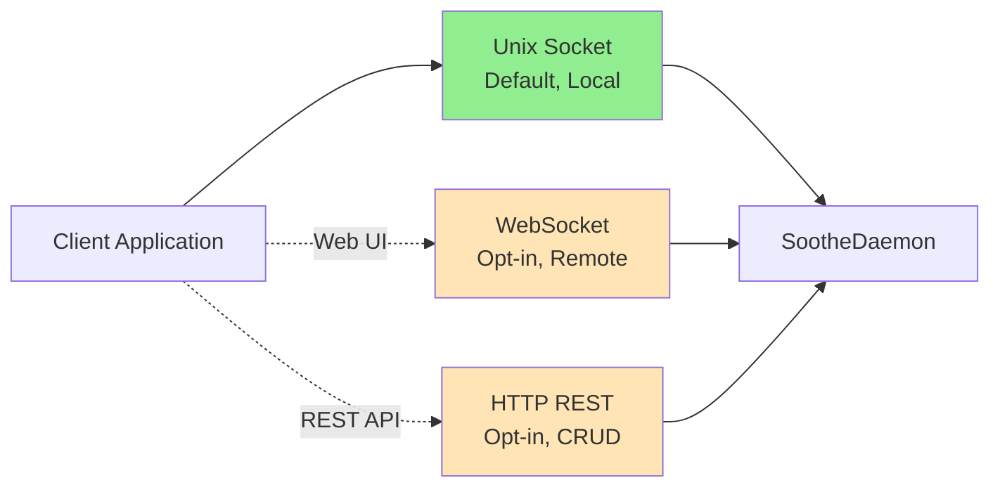
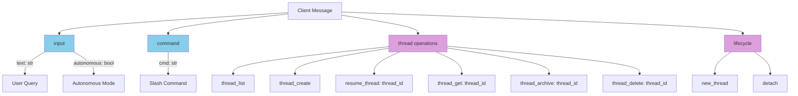
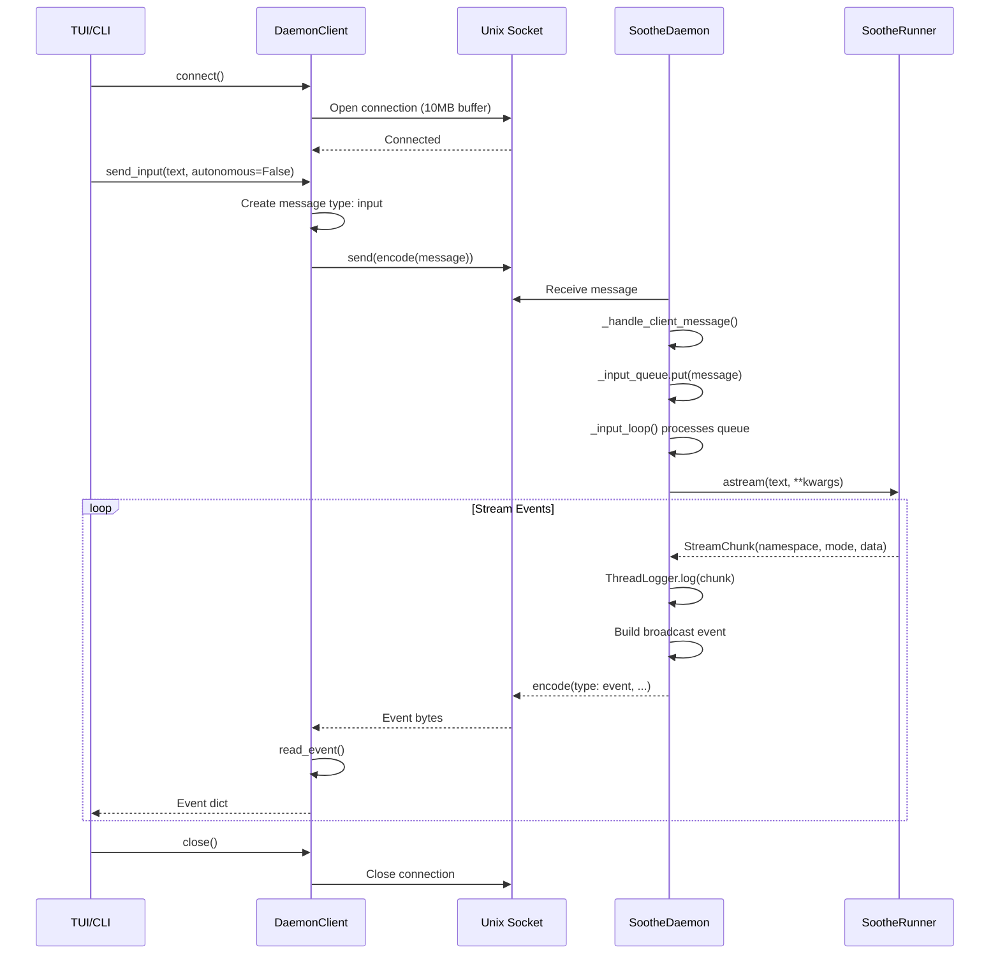
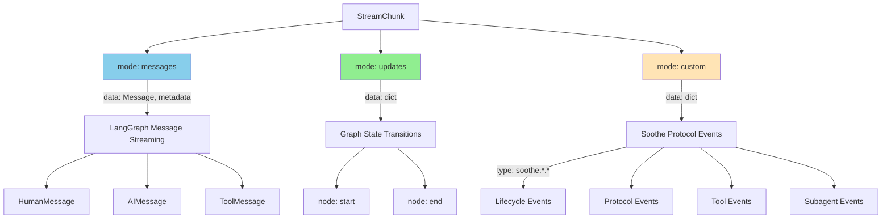
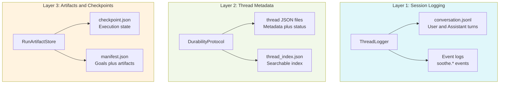
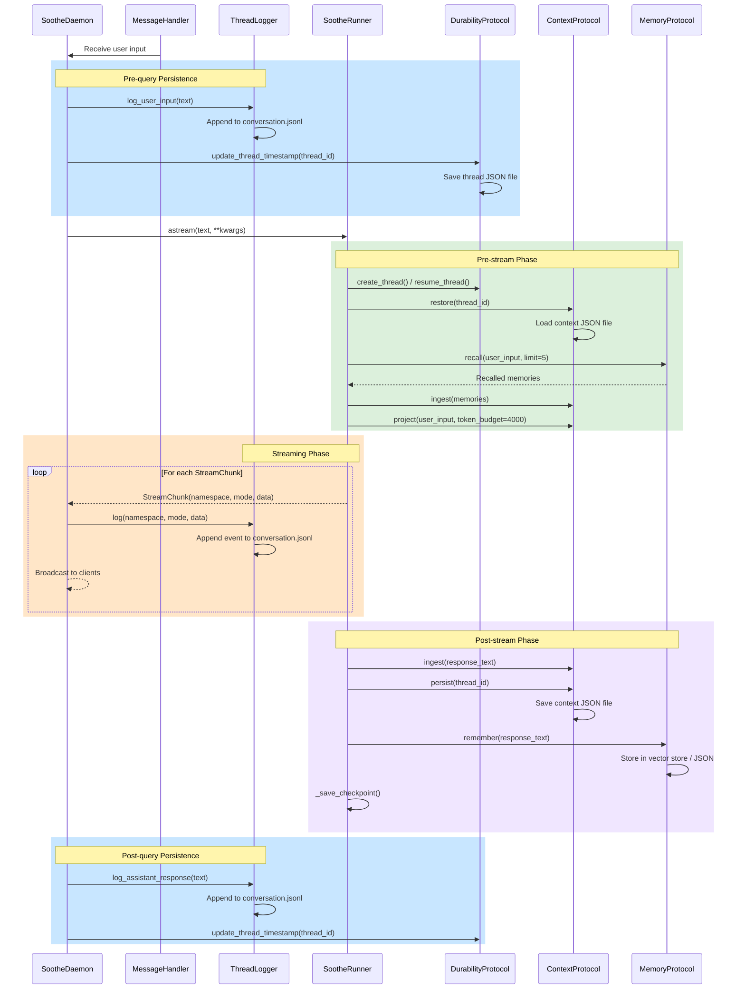
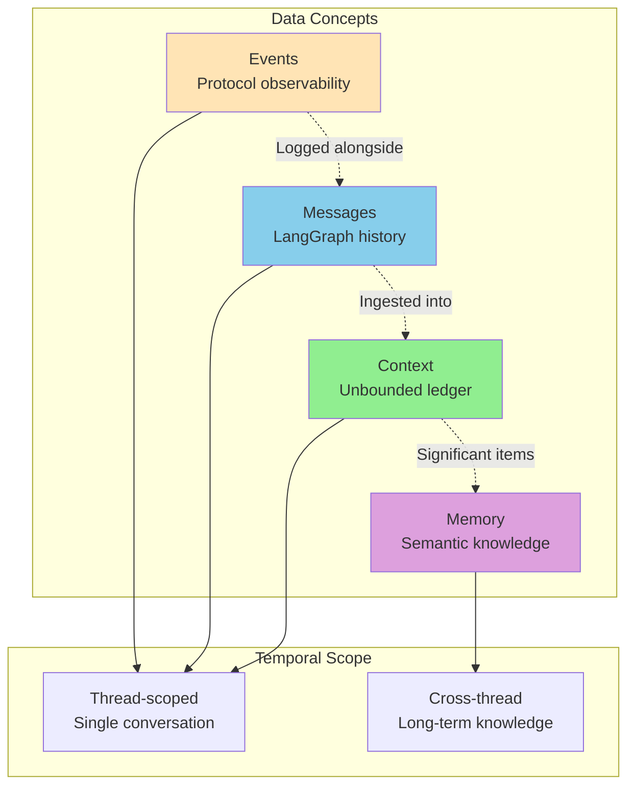
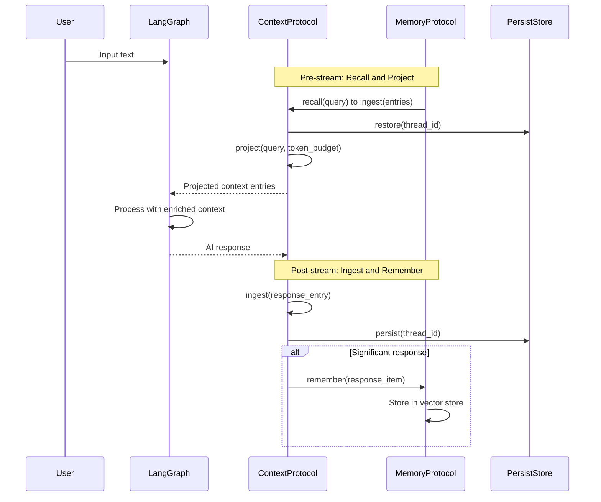
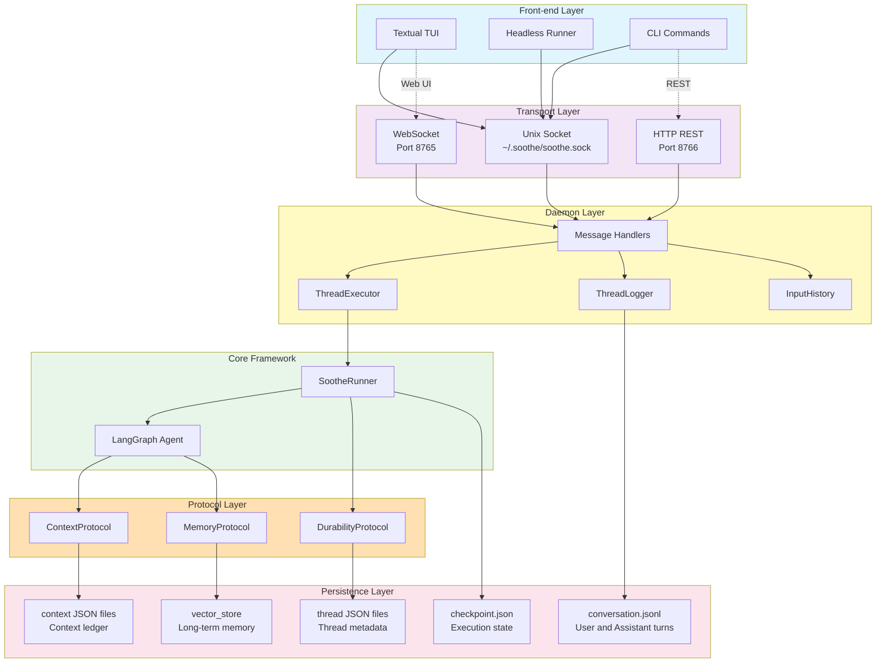

# Soothe Message Lifecycle

This document describes the complete lifecycle of messages in Soothe, including front-end/back-end communication, persistence mechanisms, and data relationships.

## Table of Contents

1. [Architecture Overview](#architecture-overview)
2. [Front-end/Back-end Communication](#front-endback-end-communication)
3. [Message Persistence](#message-persistence)
4. [Data Relationships](#data-relationships)
5. [Complete Flow Diagram](#complete-flow-diagram)

---

## Architecture Overview

Soothe uses a **daemon-based client-server architecture** with three key layers:

```
┌─────────────────────────────────────────────────────────┐
│  Front-end (CLI/TUI)                                     │
│  - Textual TUI App                                       │
│  - Headless Runner                                       │
│  - CLI Commands                                          │
└────────────────┬────────────────────────────────────────┘
                 │ Transport Layer
                 │ (Unix Socket / WebSocket / HTTP REST)
┌────────────────▼────────────────────────────────────────┐
│  Back-end (SootheDaemon)                                │
│  - Message Handlers                                      │
│  - ThreadExecutor                                        │
│  - ThreadLogger                                          │
└────────────────┬────────────────────────────────────────┘
                 │ Runner Interface
┌────────────────▼────────────────────────────────────────┐
│  Core Framework (SootheRunner)                          │
│  - LangGraph Agent                                       │
│  - Protocol Orchestration                                │
│  - Phase Management                                      │
└─────────────────────────────────────────────────────────┘
```

**Key Components:**

| Layer | Components | Responsibilities |
|-------|-----------|------------------|
| **Front-end** | TUI (Textual), Headless Runner, CLI | User interface, event rendering, input handling |
| **Transport** | Unix Socket, WebSocket, HTTP REST | Multi-protocol communication |
| **Daemon** | SootheDaemon, ThreadExecutor, ThreadLogger | Message routing, session management, logging |
| **Core** | SootheRunner, Protocols | Agent execution, state management, persistence |

---

## Front-end/Back-end Communication

### Transport Layer

Soothe daemon supports **three simultaneous transports** (RFC-400):



**Transport Characteristics:**

| Transport | Default | Port/Path | Use Case |
|-----------|---------|-----------|----------|
| **Unix Socket** | ✅ Enabled | `~/.soothe/soothe.sock` | Local CLI/TUI |
| **WebSocket** | ❌ Opt-in | 8765 | Web applications, remote clients |
| **HTTP REST** | ❌ Opt-in | 8766 | CRUD operations, health checks |

**Note on Authentication (RFC-400, RFC-402):** Soothe does not implement built-in authentication. Authentication and authorization are handled by external services such as reverse proxies, API gateways, or SSH tunneling. This design keeps Soothe simple and single-tenant.

### Message Protocol

All transports use **JSON-based framing** with the following encoding:

```python
# From daemon/protocol.py
def encode(msg: dict[str, Any]) -> bytes:
    """Encode message as JSON with newline delimiter."""
    return (json.dumps(msg, default=_serialize_for_json) + "\n").encode()

def decode(data: bytes) -> list[dict[str, Any]]:
    """Decode newline-delimited JSON messages."""
    return [json.loads(line) for line in data.decode().strip().split("\n") if line]
```

**Message Types** (validated in `daemon/protocol_v2.py`):



### Client-Server Interaction

**DaemonClient Flow** (`daemon/client.py`):



### Event Streaming Architecture

**StreamChunk Format** (deepagents-canonical):

```python
StreamChunk = tuple[tuple[str, ...], str, Any]
# (namespace, mode, data)
```

| Field | Type | Description | Example |
|-------|------|-------------|---------|
| `namespace` | `tuple[str, ...]` | Hierarchical path | `()` for main agent, `("subagent", "browser")` |
| `mode` | `str` | Chunk type | `"messages"`, `"updates"`, `"custom"` |
| `data` | `Any` | Payload | Message tuple, state dict, or event dict |

**Event Modes:**



**Event Type Taxonomy** (from `core/events.py`):

| Category | Pattern | Examples |
|----------|---------|----------|
| **Lifecycle** | `soothe.lifecycle.*` | `thread.created`, `thread.started`, `thread.saved`, `thread.ended` |
| **Protocol** | `soothe.<protocol>.<action>` | `context.projected`, `memory.recalled`, `plan.created`, `plan.step.started` |
| **Tool** | `soothe.tool.<name>.<phase>` | `tool.websearch.search_started`, `tool.research.analyze` |
| **Subagent** | `soothe.subagent.<name>.<action>` | `subagent.browser.step`, `subagent.claude.text` |

### Broadcasting to Clients

```python
# From daemon/server.py
async def _broadcast(self, msg: dict[str, Any]) -> None:
    """Broadcast event to all connected clients."""
    if self._transport_manager:
        await self._transport_manager.broadcast(msg)

# TransportManager broadcasts to all active transports
# From daemon/transport_manager.py
async def broadcast(self, message: dict[str, Any]) -> None:
    for transport in self._transports:
        await transport.broadcast(message)
```

---

## Message Persistence

### Three-Layer Persistence Architecture

Soothe maintains **three complementary persistence layers**:



### Layer 1: ThreadLogger (Session/Conversation Logging)

**Location:** `daemon/thread_logger.py`

**Storage Path:** `$SOOTHE_HOME/runs/{thread_id}/conversation.jsonl`

**Content Types:**

| Kind | Schema | Purpose |
|------|--------|---------|
| `conversation` | `{"kind": "conversation", "role": "user"/"assistant", "content": str}` | User/assistant turns |
| `event` | `{"kind": "event", "type": "soothe.*", ...}` | Protocol observability events |
| `tool_call` | `{"kind": "tool_call", "name": str, "args": dict}` | Tool invocation records |
| `tool_result` | `{"kind": "tool_result", "name": str, "result": Any}` | Tool execution results |

**Key Methods:**

```python
# From daemon/thread_logger.py
def log_user_input(self, text: str) -> None:
    """Record user input as conversation turn."""
    entry = {
        "kind": "conversation",
        "role": "user",
        "content": text,
        "timestamp": datetime.now().isoformat(),
    }
    self._write_entry(entry)

def log_assistant_response(self, text: str) -> None:
    """Record assistant response as conversation turn."""
    entry = {
        "kind": "conversation",
        "role": "assistant",
        "content": text,
        "timestamp": datetime.now().isoformat(),
    }
    self._write_entry(entry)

def log(self, namespace: tuple[str, ...], mode: str, data: Any) -> None:
    """Log StreamChunk events."""
    if mode == "custom":
        event = data
        entry = {
            "kind": "event",
            "type": event.get("type"),
            **event,
            "timestamp": datetime.now().isoformat(),
        }
        self._write_entry(entry)
```

**File Format Example:**

```json
{"kind": "conversation", "role": "user", "content": "Analyze the codebase", "timestamp": "2026-03-23T10:30:00"}
{"kind": "event", "type": "soothe.lifecycle.thread.started", "thread_id": "abc123", "timestamp": "2026-03-23T10:30:01"}
{"kind": "event", "type": "soothe.protocol.context.projected", "entries_count": 5, "timestamp": "2026-03-23T10:30:02"}
{"kind": "tool_call", "name": "grep", "args": {"pattern": "def.*protocol"}, "timestamp": "2026-03-23T10:30:05"}
{"kind": "tool_result", "name": "grep", "result": "...", "timestamp": "2026-03-23T10:30:06"}
{"kind": "conversation", "role": "assistant", "content": "Found 15 protocol definitions...", "timestamp": "2026-03-23T10:30:15"}
```

### Layer 2: DurabilityProtocol (Thread Lifecycle Metadata)

**Location:** `protocols/durability.py`

**Data Models:**

```python
# From protocols/durability.py
class ThreadMetadata(BaseModel):
    """Thread metadata."""
    tags: list[str] = Field(default_factory=list)
    labels: dict[str, str] = Field(default_factory=dict)
    priority: int = Field(default=0)
    policy_profile: str | None = None

class ThreadInfo(BaseModel):
    """Complete thread information."""
    thread_id: str
    query: str
    mode: str
    status: str  # "running", "suspended", "archived"
    created_at: datetime
    updated_at: datetime
    metadata: ThreadMetadata
    parent_thread_id: str | None = None
```

**Storage Backends:**

| Backend | Files | Features |
|---------|-------|----------|
| `JsonDurability` | `thread:{id}.json`, `thread_index.json` | Default, migration support |
| `PostgreSQLDurability` | PostgreSQL table | Production, concurrent access |
| `RocksDBDurability` | RocksDB key-value | High performance |

**Key Operations:**

```python
# From backends/durability/base.py
class BaseDurability(DurabilityProtocol):
    async def create_thread(
        self,
        query: str,
        mode: str,
        metadata: ThreadMetadata | None = None
    ) -> ThreadInfo:
        """Create new thread with UUID."""
        thread_id = f"thread:{uuid4().hex[:16]}"
        thread = ThreadInfo(
            thread_id=thread_id,
            query=query,
            mode=mode,
            status="running",
            created_at=datetime.now(),
            updated_at=datetime.now(),
            metadata=metadata or ThreadMetadata(),
        )
        self._save_thread(thread)
        return thread

    async def resume_thread(self, thread_id: str) -> ThreadInfo:
        """Activate suspended thread."""
        thread = await self.get_thread(thread_id)
        if thread.status != "suspended":
            raise InvalidThreadStateError(thread_id, thread.status, "suspended")
        thread.status = "running"
        thread.updated_at = datetime.now()
        self._save_thread(thread)
        return thread
```

**File Structure Example:**

```
$SOOTHE_HOME/runs/
├── thread_index.json          # Searchable index
├── thread:abc123.json         # Thread metadata
├── thread:def456.json
└── thread:ghi789.json
```

### Layer 3: RunArtifactStore (Checkpoint & Artifacts)

**Location:** `core/artifact_store.py`

**Storage Structure:**

```
$SOOTHE_HOME/runs/{thread_id}/
├── manifest.json           # RunManifest (goals, artifacts)
├── checkpoint.json         # Execution state snapshot
├── conversation.jsonl      # ThreadLogger output
└── goals/{goal_id}/steps/{step_id}/
    ├── report.json         # Step execution report
    └── report.md           # Human-readable report
```

**RunManifest Schema:**

```python
# From core/artifact_store.py
class RunManifest(BaseModel):
    """Run manifest tracking goals and artifacts."""
    thread_id: str
    query: str
    mode: str
    status: str
    created_at: datetime
    updated_at: datetime
    goals: list[GoalInfo] = Field(default_factory=list)
    artifacts: list[ArtifactInfo] = Field(default_factory=list)

class GoalInfo(BaseModel):
    """Goal information."""
    goal_id: str
    description: str
    status: str
    steps: list[StepInfo]

class ArtifactInfo(BaseModel):
    """Artifact information."""
    artifact_id: str
    name: str
    path: str
    size: int
    created_at: datetime
```

### PersistStore Abstraction

**Protocol Definition:**

```python
# From protocols/persistence.py
class PersistStore(Protocol):
    """Generic key-value persistence interface."""

    def save(self, key: str, data: Any) -> None:
        """Save data under key."""
        ...

    def load(self, key: str) -> Any | None:
        """Load data by key."""
        ...

    def delete(self, key: str) -> None:
        """Delete data by key."""
        ...

    def close(self) -> None:
        """Close store and release resources."""
        ...
```

**Implementations:**

| Backend | Storage | Use Case |
|---------|---------|----------|
| `JsonPersistStore` | `{persist_dir}/{key}.json` | Development, simple persistence |
| `RocksDBPersistStore` | RocksDB database | Production, high performance |
| `PostgreSQLPersistStore` | PostgreSQL table | Production, concurrent access |

### When Persistence Happens

**Query Execution Flow with Persistence Points:**



---

## Data Relationships

### Messages vs Context vs Events vs Memory

Soothe maintains **four distinct data concepts** that serve different purposes:



### Detailed Comparison

| Aspect | Messages | Events | Context | Memory |
|--------|----------|--------|---------|--------|
| **Scope** | Single thread | Single thread | Thread-persisted | Cross-thread |
| **Lifetime** | Thread-bound | Thread-bound | Thread-bound | Long-term |
| **Purpose** | LLM conversation | Protocol observability | Knowledge ledger | Semantic knowledge |
| **Structure** | `HumanMessage`, `AIMessage` | `{"type": "soothe.*", ...}` | `ContextEntry` | `MemoryItem` |
| **Query Method** | Sequential | Sequential | Keyword/Vector search | Vector similarity |
| **Persistence** | `conversation.jsonl` | `conversation.jsonl` | `context_{thread_id}.json` | Vector store / JSON |
| **Size Bound** | Limited by context window | Unlimited | Unlimited | Unlimited |

### Messages (LangGraph Conversation History)

**Definition:** LangGraph message history used for LLM context window.

**Schema:**

```python
from langchain_core.messages import HumanMessage, AIMessage, ToolMessage

# Messages are LangChain message objects
messages: list[BaseMessage] = [
    HumanMessage(content="Analyze the codebase"),
    AIMessage(content="I'll search for protocol definitions..."),
    ToolMessage(content="Found 15 protocols", tool_call_id="..."),
    AIMessage(content="Here's the analysis..."),
]
```

**Characteristics:**

- **Scope:** Single thread, ephemeral (reconstructed on resume)
- **Purpose:** Provide LLM with conversation history for context
- **Storage:** Logged in `conversation.jsonl` but **not directly persisted** as structured state
- **Lifecycle:**
  1. User input → `HumanMessage` added to graph state
  2. Agent processes → `AIMessage` with tool calls
  3. Tools execute → `ToolMessage` with results
  4. Agent responds → Final `AIMessage`

### Events (Protocol Observability)

**Definition:** Custom events emitted during execution for observability.

**Schema:**

```python
# From core/events.py
StreamChunk = tuple[tuple[str, ...], str, Any]

# Custom events have mode="custom"
event_chunk = (
    (),  # namespace (empty for main agent)
    "custom",  # mode
    {
        "type": "soothe.protocol.context.projected",
        "entries_count": 5,
        "token_budget": 4000,
        "timestamp": "2026-03-23T10:30:02",
    }
)
```

**Event Categories:**

```python
# Lifecycle events
THREAD_CREATED = "soothe.lifecycle.thread.created"
THREAD_STARTED = "soothe.lifecycle.thread.started"
THREAD_SAVED = "soothe.lifecycle.thread.saved"
THREAD_ENDED = "soothe.lifecycle.thread.ended"

# Protocol events
CONTEXT_PROJECTED = "soothe.protocol.context.projected"
MEMORY_RECALLED = "soothe.protocol.memory.recalled"
PLAN_CREATED = "soothe.cognition.plan.created"
PLAN_STEP_STARTED = "soothe.cognition.plan.step.started"

# Tool events
TOOL_WEBSEARCH_SEARCH_STARTED = "soothe.tool.websearch.search_started"
TOOL_RESEARCH_ANALYZE = "soothe.tool.research.analyze"

# Subagent events
SUBAGENT_BROWSER_STEP = "soothe.subagent.browser.step"
SUBAGENT_CLAUDE_TEXT = "soothe.subagent.claude.text"
```

**Characteristics:**

- **Scope:** Single thread, streaming lifecycle
- **Purpose:** Observability, progress tracking, TUI rendering
- **Storage:** Logged in `conversation.jsonl` with `kind="event"`
- **Lifecycle:**
  1. Protocol operation triggers event emission
  2. Event wrapped in `StreamChunk` with `mode="custom"`
  3. Streamed to daemon via `runner.astream()`
  4. Daemon logs and broadcasts to clients

### Context (Unbounded Knowledge Ledger)

**Definition:** Thread-scoped, unbounded knowledge ledger that persists across thread sessions.

**Protocol Definition:**

```python
# From protocols/context.py
class ContextEntry(BaseModel):
    """Single entry in the context ledger."""
    source: str  # Origin: tool, subagent, user, memory
    content: str  # Knowledge content
    timestamp: datetime
    tags: list[str] = Field(default_factory=list)
    importance: float = Field(default=1.0)  # 0.0-1.0 relevance weight

class ContextProtocol(Protocol):
    """Unbounded context ledger with bounded projection."""

    async def ingest(self, entry: ContextEntry) -> None:
        """Add entry to the ledger."""
        ...

    async def project(
        self,
        query: str,
        token_budget: int = 4000,
        tags: list[str] | None = None,
    ) -> list[ContextEntry]:
        """Get bounded, relevant subset for LLM context."""
        ...

    async def persist(self, thread_id: str) -> None:
        """Save ledger to persistent storage."""
        ...

    async def restore(self, thread_id: str) -> None:
        """Load ledger from persistent storage."""
        ...
```

**Key Insight:** "Unbounded ledger, bounded projection" (RFC-000 principle #4)

- **Ledger:** Unlimited storage of knowledge entries
- **Projection:** Limited subset retrieved for LLM context window

**Characteristics:**

- **Scope:** Thread-scoped, persisted across sessions
- **Purpose:** Accumulate knowledge within a thread's lifetime
- **Storage:** `context_{thread_id}.json` via PersistStore
- **Query Methods:**
  - **KeywordContext:** TF-IDF scoring for relevance
  - **VectorContext:** Semantic similarity search

**Interaction Flow:**

```python
# Pre-stream: Restore and project
context.restore(thread_id)
projection = await context.project(user_input, token_budget=4000)

# Build enriched input with context
enriched_input = build_enriched_input(user_input, projection, memories)

# Post-stream: Ingest response
await context.ingest(
    ContextEntry(
        source="agent",
        content=response_text[:2000],
        tags=["agent_response"],
        importance=0.7,
    )
)

# Persist updated ledger
await context.persist(thread_id)
```

### Memory (Cross-Thread Semantic Knowledge)

**Definition:** Long-term, cross-thread knowledge storage with semantic retrieval.

**Protocol Definition:**

```python
# From protocols/memory.py
class MemoryItem(BaseModel):
    """Single memory item."""
    id: str = Field(default_factory=lambda: uuid4().hex)
    content: str  # Knowledge content
    source_thread: str  # Origin thread ID
    created_at: datetime = Field(default_factory=datetime.now)
    tags: list[str] = Field(default_factory=list)
    importance: float = Field(default=1.0)
    metadata: dict[str, Any] = Field(default_factory=dict)

class MemoryProtocol(Protocol):
    """Long-term memory with semantic retrieval."""

    async def remember(self, item: MemoryItem) -> None:
        """Store new memory."""
        ...

    async def recall(
        self,
        query: str,
        limit: int = 5,
    ) -> list[MemoryItem]:
        """Retrieve memories by semantic similarity."""
        ...

    async def recall_by_tags(
        self,
        tags: list[str],
        limit: int = 10,
    ) -> list[MemoryItem]:
        """Retrieve memories by tags."""
        ...
```

**Characteristics:**

- **Scope:** Cross-thread, global knowledge base
- **Purpose:** Long-term knowledge accumulation across sessions
- **Storage:** Vector store (PGVector, Weaviate) or JSON
- **Query Method:** Semantic similarity search

**Interaction Flow:**

```python
# Pre-stream: Recall relevant memories
items = await memory.recall(user_input, limit=5)

# Ingest recalled memories into context for this turn
for item in items:
    await context.ingest(
        ContextEntry(
            source="memory",
            content=item.content,
            tags=item.tags,
            importance=item.importance,
        )
    )

# Post-stream: Store significant responses as memories
if len(response_text) > MIN_MEMORY_STORAGE_LENGTH:
    await memory.remember(
        MemoryItem(
            content=response_text[:500],
            tags=["agent_response"],
            source_thread=thread_id,
        )
    )
```

### Data Transformation Flow



---

## Complete Flow Diagram

### End-to-End Message Lifecycle



### Detailed Query Flow with Data Transformations

```mermaid
sequenceDiagram
    participant User
    participant TUI as TUI/CLI
    participant Client as DaemonClient
    participant Daemon as SootheDaemon
    participant Runner as SootheRunner
    participant Context as ContextProtocol
    participant Memory as MemoryProtocol
    participant Durability as DurabilityProtocol
    participant Agent as LangGraph Agent

    User->>TUI: Submit query
    TUI->>Client: send_input(text)

    Note over Client,Daemon: Transport: Unix Socket JSON
    Client->>Daemon: type: input, text: text

    activate Daemon
    Daemon->>Daemon: ThreadLogger.log_user_input(text)

    Note right of Daemon: Persist: conversation.jsonl<br/>kind: conversation, role: user

    Daemon->>Durability: update_thread_timestamp(thread_id)
    Durability->>Durability: Save thread JSON file

    Daemon->>Runner: astream(text, thread_id)
    activate Runner

    Note over Runner,Durability: Pre-stream Phase
    Runner->>Durability: resume_thread(thread_id)
    Durability-->>Runner: ThreadInfo

    Runner->>Context: restore(thread_id)
    Note right of Context: Load: context JSON file
    Context-->>Runner: Context restored

    Runner->>Memory: recall(text, limit=5)
    Memory-->>Runner: Recalled MemoryItems

    loop For each MemoryItem
        Runner->>Context: ingest(memory_entry)
    end

    Runner->>Context: project(text, token_budget=4000)
    Context-->>Runner: Projected ContextEntries

    Note over Runner,Agent: LangGraph Stream
    Runner->>Agent: astream(enriched_input)

    loop Stream Events
        Agent-->>Runner: StreamChunk(namespace, mode, data)

        alt mode == messages
            Note right of Runner: Extract AI message text
            Runner->>Runner: Extract response text
        else mode == custom
            Note right of Runner: Protocol event
            Runner->>Runner: Emit soothe.* event
        end

        Runner-->>Daemon: StreamChunk
        Daemon->>Daemon: ThreadLogger.log(namespace, mode, data)

        Note right of Daemon: Persist: conversation.jsonl<br/>kind: event, type: soothe.*

        Daemon-->>Client: type: event, namespace: ..., mode: mode, data: data
        Client-->>TUI: Event dict
        TUI-->>User: Render progress
    end

    deactivate Agent

    Note over Runner,Memory: Post-stream Phase
    Runner->>Context: ingest(response_entry)
    Runner->>Context: persist(thread_id)

    Note right of Context: Save: context JSON file

    alt Significant response
        Runner->>Memory: remember(response_item)
        Note right of Memory: Store: vector_store
    end

    Runner->>Runner: _save_checkpoint()
    Note right of Runner: Save: checkpoint.json

    deactivate Runner
    Runner-->>Daemon: Complete

    Daemon->>Daemon: ThreadLogger.log_assistant_response(text)

    Note right of Daemon: Persist: conversation.jsonl<br/>kind: conversation, role: assistant

    Daemon->>Durability: update_thread_timestamp(thread_id)
    Daemon-->>Client: Stream complete
    deactivate Daemon

    Client-->>TUI: Done
    TUI-->>User: Display final result
```

---

## Summary

### Key Insights

1. **Three-Layer Persistence:**
   - **ThreadLogger:** Session/conversation logging (JSONL append-only)
   - **DurabilityProtocol:** Thread lifecycle metadata (JSON/PostgreSQL/RocksDB)
   - **RunArtifactStore:** Checkpoints and artifacts (JSON + file system)

2. **Four Data Concepts:**
   - **Messages:** LangGraph conversation history (thread-scoped, ephemeral)
   - **Events:** Protocol observability (thread-scoped, logged)
   - **Context:** Unbounded knowledge ledger (thread-scoped, persisted)
   - **Memory:** Long-term semantic knowledge (cross-thread, persistent)

3. **Unbounded Ledger, Bounded Projection:**
   - Context ledger has unlimited storage
   - Projection to LLM context window is bounded by token budget
   - Semantic search (vector or TF-IDF) selects relevant entries

4. **Multi-Transport Architecture:**
   - Unix Socket for local CLI/TUI (default, always enabled)
   - WebSocket for web applications (opt-in, remote access)
   - HTTP REST for CRUD operations (opt-in, API access)

5. **Streaming-First Design:**
   - All events flow through `StreamChunk` format
   - Daemon logs and broadcasts simultaneously
   - TUI renders progress in real-time

6. **No Built-in Authentication:**
   - Authentication handled by external services (reverse proxies, API gateways)
   - Soothe is single-tenant by design
   - Unix socket uses filesystem permissions for local security

### File Reference Summary

| Component | File Path | Purpose |
|-----------|-----------|---------|
| Daemon Server | `src/soothe/daemon/server.py` | Multi-transport daemon |
| Message Handlers | `src/soothe/daemon/_handlers.py` | Client message routing |
| Thread Logger | `src/soothe/daemon/thread_logger.py` | Session logging |
| Protocol Encoding | `src/soothe/daemon/protocol.py` | JSON serialization |
| Protocol Validation | `src/soothe/daemon/protocol_v2.py` | Message type validation |
| Transport Manager | `src/soothe/daemon/transport_manager.py` | Multi-transport coordination |
| Unix Socket Transport | `src/soothe/daemon/transports/unix_socket.py` | Unix socket implementation |
| Daemon Client | `src/soothe/daemon/client.py` | Client-side connection |
| Runner Core | `src/soothe/core/runner/__init__.py` | Protocol orchestration |
| Runner Phases | `src/soothe/core/runner/_runner_phases.py` | Pre/post-stream logic |
| Event Types | `src/soothe/core/events.py` | Event type definitions |
| Context Protocol | `src/soothe/protocols/context.py` | Context ledger interface |
| Memory Protocol | `src/soothe/protocols/memory.py` | Long-term memory interface |
| Durability Protocol | `src/soothe/protocols/durability.py` | Thread metadata interface |
| Persist Store | `src/soothe/protocols/persistence.py` | Generic persistence interface |
| TUI App | `src/soothe/ux/tui/app.py` | Textual TUI application |

---

## References

- [RFC-000: System Conceptual Design](../specs/RFC-000-system-conceptual-design.md)
- [RFC-300: Context and Memory Architecture Design](../specs/RFC-300-context-memory-protocols.md)
- [RFC-201: Agentic Goal Execution](../specs/RFC-201-agentic-goal-execution.md)
- [RFC-202: DAG Execution & Failure Recovery](../specs/RFC-202-dag-execution.md)
- [RFC-400: Daemon Communication Protocol](../specs/RFC-400-daemon-communication.md)
- [RFC-402: Unified Thread Management Architecture](../specs/RFC-402-unified-thread-management.md)
