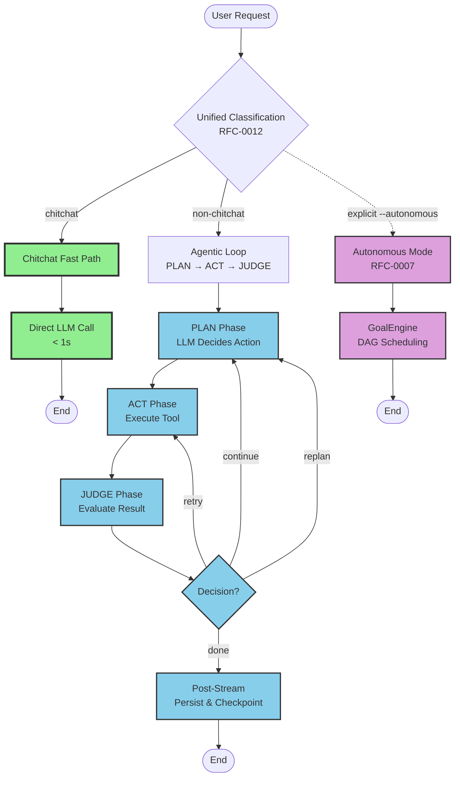
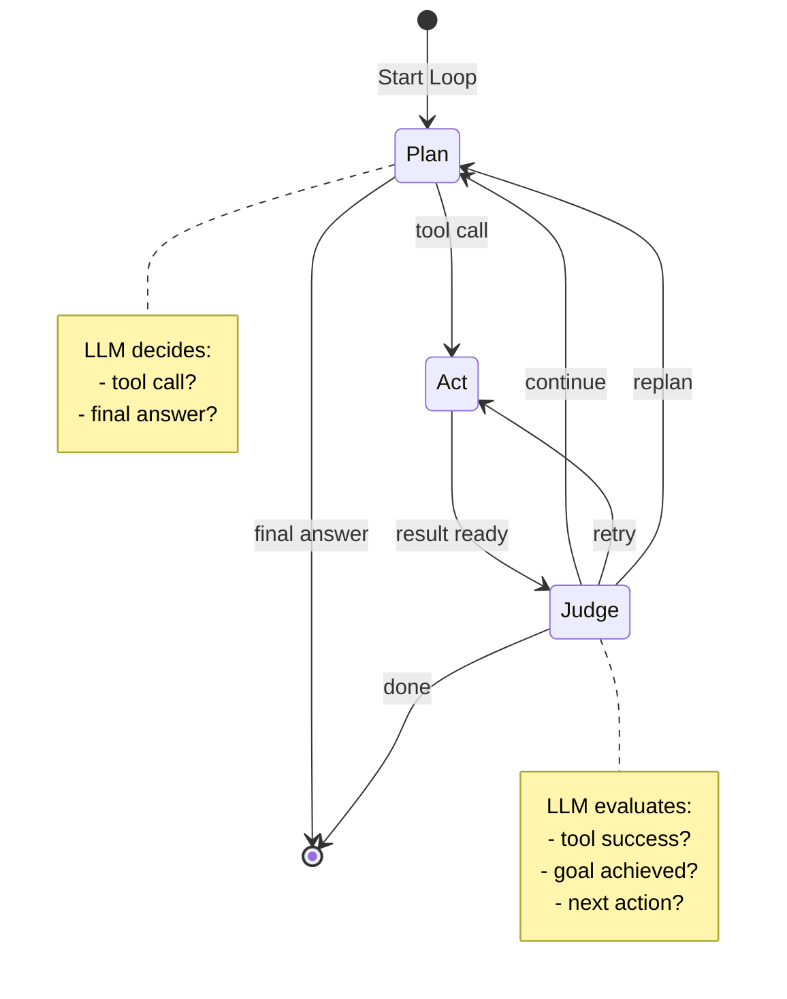

# RFC-0008: Agentic Loop Execution Architecture

**RFC**: 0008
**Title**: Agentic Loop Execution Architecture
**Status**: Draft
**Created**: 2026-03-16
**Updated**: 2026-03-27
**Related**: RFC-0001, RFC-0002, RFC-0003, RFC-0007, RFC-0009, RFC-0012

## Abstract

This RFC defines Soothe's default execution architecture based on the **Claude-CLI-style Agentic Loop** (LoopAgent): **PLAN → ACT → JUDGE**. This iterative loop replaces the previous observe-act-verify model with explicit LLM-based judgment using structured outputs, enabling reliable evaluation of tool success, goal completion, and strategy adjustment. The architecture maintains sub-second responses for simple queries through a chitchat fast path while providing intelligent iteration for complex tasks without the overhead of explicit goal management required in Autonomous mode (RFC-0007).

## Motivation

### Problem Statement

Before this RFC, Soothe used an **OBSERVE → ACT → VERIFY** execution model with text pattern matching for verification:

**Limitations**:
1. **Unreliable verification**: Text patterns ("done", "complete") can appear in any context
2. **No tool success evaluation**: Cannot reliably determine if tools succeeded or failed
3. **No strategy adjustment**: Can only continue or stop, not "retry" or "replan"
4. **No failure mode detection**: Missing repeated action detection, hallucination checks, silent failure detection
5. **No structured tool outputs**: Tools return plain strings, making judgment unreliable

### Design Goals

1. **Explicit PLAN phase**: LLM decides next action (tool call or final answer)
2. **Structured ACT phase**: Execute tools with required structured output
3. **LLM-based JUDGE phase**: Evaluate results with structured output, not text patterns
4. **Robust guardrails**: Detect and handle failure modes (repeated actions, hallucinations, silent failures)
5. **Sub-second chitchat**: Simple queries remain fast (direct LLM, no overhead)
6. **Lighter than autonomous**: No goal engine overhead for standard tasks

### Relationship to RFC-0007 (Autonomous Mode)

**Two complementary execution modes**:

| Aspect | Agentic Loop (This RFC) | Autonomous Mode (RFC-0007) |
|--------|-------------------------|----------------------------|
| **Trigger** | Default for all non-chitchat queries | Explicit `--autonomous` flag |
| **Loop Sequence** | PLAN → ACT → JUDGE | Goal → Plan → Reflect |
| **Goal Management** | Implicit (thread-scoped) | Explicit GoalEngine with DAG |
| **Iteration Control** | Judge-based continuation | Reflection-based goal completion |
| **Planning** | Adaptive (complexity-driven) | Always comprehensive |
| **Overhead** | Minimal (stateless) | Goal lifecycle, persistence |
| **Use Case** | Standard tasks (90%) | Complex multi-goal workflows (10%) |

**Refer to RFC-0007 for**: Goal DAG scheduling, hierarchical goals, goal directives, multi-threaded parallel execution.

### Three-Layer Loop Architecture

**Soothe implements THREE nested loops**:

```
Layer 3: Autonomous Loop (runner, RFC-0007)
  └─> Goal-driven iteration with GoalEngine, max 10 iterations

Layer 2: Agentic Loop (runner, this RFC)
  └─> PLAN → ACT → JUDGE reflection loop, max 3 iterations

Layer 1: deepagents Tool Loop (graph, langchain)
  └─> Model → Tools → Model tool-calling loop, recursion_limit=1000
```

**Key insight**: deepagents **provides a tool-calling loop** (Layer 1). Soothe adds **reflection** (Layer 2) and **goal management** (Layer 3) on top.

## Architecture Overview

### Two Execution Modes



## Interfaces & Data Models

### AgentDecision Schema

The LLM's decision on next action:

```python
from typing import Literal, Optional, Dict, Any
from pydantic import BaseModel, Field

class AgentDecision(BaseModel):
    """LLM's decision on next action in the agentic loop."""

    type: Literal["tool", "final"]
    tool: Optional[str] = Field(None, description="Tool name if type='tool'")
    args: Optional[Dict[str, Any]] = Field(None, description="Tool arguments if type='tool'")
    reasoning: str = Field(..., description="LLM's rationale for this decision")
    answer: Optional[str] = Field(None, description="Final answer if type='final'")
```

| Field | Type | Description |
|-------|------|-------------|
| `type` | `"tool"` or `"final"` | If `"tool"`, call a tool; if `"final"`, finish with answer |
| `tool` | String | Tool name to invoke (if type="tool") |
| `args` | Object | Arguments for the tool (if type="tool") |
| `reasoning` | String | LLM's rationale for this decision |
| `answer` | String | Final answer (if type="final") |

### JudgeResult Schema

The LLM's judgment after evaluating tool execution:

```python
class JudgeResult(BaseModel):
    """LLM's judgment after evaluating tool execution result."""

    status: Literal["continue", "retry", "replan", "done"]
    reason: str = Field(..., description="Explanation for the judgment")
    next_hint: Optional[str] = Field(None, description="Hint for retry if status='retry'")
    final_answer: Optional[str] = Field(None, description="Final answer if status='done'")
    confidence: Optional[float] = Field(None, ge=0.0, le=1.0, description="Judge's confidence (0.0-1.0)")
```

| Field | Type | Description |
|-------|------|-------------|
| `status` | `"continue"` \| `"retry"` \| `"replan"` \| `"done"` | Next action to take |
| `reason` | String | Explanation for the judgment |
| `next_hint` | String | Hint for retry (if status="retry") |
| `final_answer` | String | Final answer (if status="done") |
| `confidence` | Float | Judge's confidence score (0.0-1.0) |

**Status Meanings**:
- `"continue"`: Keep going with next iteration
- `"retry"`: Retry current step with adjustments (use `next_hint`)
- `"replan"`: Trigger higher-level plan revision
- `"done"`: Task complete, return `final_answer`

### ToolOutput Schema

Structured return value from tool execution:

```python
class ToolOutput(BaseModel):
    """Structured return value from tool execution."""

    success: bool = Field(..., description="Whether tool execution succeeded")
    data: Optional[Any] = Field(None, description="Result data")
    error: Optional[str] = Field(None, description="Error message if failed")
    error_type: Optional[Literal["transient", "permanent", "user_error"]] = Field(
        None, description="Error classification"
    )
```

| Field | Type | Description |
|-------|------|-------------|
| `success` | Boolean | Whether tool execution succeeded |
| `data` | Any | Result data (structure depends on tool) |
| `error` | String | Error message (if success=False) |
| `error_type` | String | Error classification: "transient", "permanent", or "user_error" |

**Error Types**:
- `"transient"`: Temporary error (network timeout, rate limit) → retry recommended
- `"permanent"`: Permanent error (file not found, permission denied) → no retry
- `"user_error"`: Invalid user input → abort with error message

### LoopState Schema

State maintained across agentic loop iterations:

```python
class LoopState(BaseModel):
    """State maintained across agentic loop iterations."""

    goal: str = Field(..., description="Task description")
    iteration: int = Field(0, ge=0, description="Current iteration count")
    history: list[StepRecord] = Field(default_factory=list, description="Step records")
    plan: Optional[Any] = Field(None, description="High-level plan (from PlanAgent)")
```

| Field | Type | Description |
|-------|------|-------------|
| `goal` | String | Task description |
| `iteration` | Integer | Current iteration count (starts at 0) |
| `history` | List[StepRecord] | Full history of decisions/results/judgments |
| `plan` | Any | Optional high-level plan (if using PlanAgent) |

### StepRecord Schema

Record of a single iteration:

```python
class StepRecord(BaseModel):
    """Record of a single iteration in the agentic loop."""

    step: int = Field(..., ge=0, description="Iteration number")
    decision: AgentDecision = Field(..., description="LLM's decision")
    result: ToolOutput = Field(..., description="Tool execution result")
    judgment: JudgeResult = Field(..., description="LLM's judgment")
```

## Control Flow & State Machine

### Loop Execution Pseudocode

```python
state = LoopState(goal=user_goal, iteration=0, history=[])

while state.iteration < max_iterations:
    # PLAN: LLM decides next action
    decision = await llm.plan(state)
    emit_event("soothe.agentic.plan.completed", decision=decision)

    if decision.type == "final":
        return decision.answer

    # ACT: Execute tool
    result = await execute_tool(decision.tool, decision.args)
    emit_event("soothe.agentic.act.completed", result=result)

    # JUDGE: Evaluate result
    judgment = await llm.judge(state.goal, decision, result)
    emit_event("soothe.agentic.judge.completed", judgment=judgment)

    # Update state
    state.add_step(decision, result, judgment)

    # Decide next action based on judgment
    if judgment.status == "done":
        return judgment.final_answer
    elif judgment.status == "retry":
        # Retry with adjustment (use next_hint)
        continue
    elif judgment.status == "replan":
        # Trigger higher-level replan
        continue
    # else: status == "continue", loop to next iteration
```

### State Machine Diagram



### Phase Details

#### Phase 1: PLAN

**Purpose**: LLM decides the next action.

**Process**:
1. Build planning context from `LoopState`:
   - Goal
   - Current iteration
   - History of previous steps
   - Available tools and their schemas
2. Invoke LLM with structured output request
3. Parse response as `AgentDecision`
4. Emit `soothe.agentic.plan.completed` event

**Planning Context Example**:
```
Goal: Count the lines in /tmp/test.txt

Available tools:
- read_file(path: str) -> ToolOutput
- write_file(path: str, content: str) -> ToolOutput
- search(query: str) -> ToolOutput

History: (empty)

What action should you take next?
```

**Decision Output**:
```json
{
  "type": "tool",
  "tool": "read_file",
  "args": {"path": "/tmp/test.txt"},
  "reasoning": "Need to read the file to count lines"
}
```

#### Phase 2: ACT

**Purpose**: Execute the tool with validation.

**Process**:
1. Validate tool exists in registry (prevent hallucination)
2. Validate tool arguments against schema
3. Execute tool with timeout
4. Validate result is `ToolOutput` structure
5. Detect silent failures (success=True but data=None)
6. Emit `soothe.agentic.act.completed` event

**Tool Execution**:
```python
async def execute_tool(tool_name: str, args: dict) -> ToolOutput:
    # Validate tool exists
    if tool_name not in tool_registry:
        return ToolOutput.fail(
            error=f"Tool '{tool_name}' not found",
            error_type="permanent"
        )

    # Execute with timeout
    try:
        result = await asyncio.wait_for(
            tool_registry[tool_name].run(**args),
            timeout=30.0
        )
        return result
    except asyncio.TimeoutError:
        return ToolOutput.fail(
            error="Tool execution timeout",
            error_type="transient"
        )
    except Exception as e:
        return ToolOutput.fail(
            error=str(e),
            error_type="permanent"
        )
```

#### Phase 3: JUDGE

**Purpose**: LLM evaluates result and decides next action.

**Process**:
1. Build judgment context:
   - Goal
   - Decision made
   - Tool result
   - Previous history
2. Invoke LLM with structured output request
3. Parse response as `JudgeResult`
4. Emit `soothe.agentic.judge.completed` event
5. Apply judgment decision

**Judgment Context Example**:
```
Goal: Count the lines in /tmp/test.txt

Action taken: read_file(path="/tmp/test.txt")

Result:
{
  "success": true,
  "data": {"lines": 42, "content": "..."},
  "error": null
}

Evaluate:
1. Did the tool succeed?
2. Is the goal achieved?
3. What action is needed? (continue/retry/replan/done)
```

**Judgment Output**:
```json
{
  "status": "done",
  "reason": "Successfully read file and counted 42 lines",
  "final_answer": "The file /tmp/test.txt has 42 lines",
  "confidence": 0.95
}
```

## Guardrails & Failure Modes

### Constraints

| Constraint | Default | Description |
|------------|---------|-------------|
| `max_iterations` | 3 | Maximum loop iterations |
| `max_retries` | 3 | Maximum consecutive retries per step |
| `tool_timeout` | 30s | Timeout for each tool execution |
| `repeated_action_threshold` | 3 | Abort if same action repeated N times |

### Failure Mode Detection

#### 1. Repeated Action Detection

Detect when the same tool+args is executed repeatedly:

```python
def detect_degenerate_retry(history: list[StepRecord]) -> bool:
    """Detect same action repeated 3+ times."""
    if len(history) < 3:
        return False

    last_3 = history[-3:]
    # Check if all three have same tool and args
    return (
        last_3[0].decision.tool == last_3[1].decision.tool == last_3[2].decision.tool
        and last_3[0].decision.args == last_3[1].decision.args == last_3[2].decision.args
    )
```

**Action**: Abort loop with error event.

#### 2. Tool Hallucination Prevention

Validate tool exists before execution:

```python
def validate_tool(tool_name: str, tool_registry: set[str]) -> bool:
    """Check if tool exists in registry."""
    return tool_name in tool_registry
```

**Action**: Return `ToolOutput.fail(error_type="permanent")`.

#### 3. Silent Failure Detection

Detect tools that return success but empty/invalid data:

```python
def detect_silent_failure(result: ToolOutput) -> bool:
    """Detect tool that returned success but no data."""
    return result.success and result.data is None
```

**Action**: Judge should flag this and recommend retry.

#### 4. Error Classification

Classify errors to enable retry logic:

| Error Type | Example | Retry? |
|------------|---------|--------|
| `"transient"` | Network timeout, rate limit | ✅ Yes |
| `"permanent"` | File not found, permission denied | ❌ No |
| `"user_error"` | Invalid input, missing argument | ❌ No |

### Guardrail Enforcement

```python
class FailureDetector:
    """Detect and handle failure modes in agentic loop."""

    def check_failures(self, state: LoopState, decision: AgentDecision, result: ToolOutput) -> Optional[str]:
        """Check for failure modes and return error message if detected."""

        # Check repeated actions
        if detect_degenerate_retry(state.history):
            return "Degenerate retry detected: same action repeated 3 times"

        # Check tool hallucination
        if decision.is_tool_call() and decision.tool not in self.tool_registry:
            return f"Tool hallucination: tool '{decision.tool}' not found"

        # Check silent failure
        if detect_silent_failure(result):
            return f"Silent failure: tool returned success but no data"

        # Check max iterations
        if state.iteration >= self.max_iterations:
            return f"Max iterations reached: {self.max_iterations}"

        return None
```

## Tool Interface Requirements

### Mandatory Structured Output

**All tools must return `ToolOutput` structure**:

```python
from soothe.core.loop_state import ToolOutput

def read_file(path: str) -> ToolOutput:
    """Read a file and return structured output."""
    try:
        with open(path) as f:
            content = f.read()
        return ToolOutput.ok(
            data={"content": content, "lines": len(content.splitlines())}
        )
    except FileNotFoundError:
        return ToolOutput.fail(
            error=f"File not found: {path}",
            error_type="user_error"
        )
    except PermissionError:
        return ToolOutput.fail(
            error=f"Permission denied: {path}",
            error_type="permanent"
        )
    except Exception as e:
        return ToolOutput.fail(
            error=str(e),
            error_type="permanent"
        )
```

### Input Validation

Tools must validate inputs and return appropriate error types:

```python
def search(query: str) -> ToolOutput:
    """Search for information."""
    # Validate input
    if not query or len(query.strip()) == 0:
        return ToolOutput.fail(
            error="Query cannot be empty",
            error_type="user_error"
        )

    # Execute search
    try:
        results = external_search(query)
        return ToolOutput.ok(data={"results": results})
    except RateLimitError:
        return ToolOutput.fail(
            error="Rate limit exceeded, please retry later",
            error_type="transient"
        )
```

### Backward Compatibility Wrapper

For legacy tools that return plain strings:

```python
def wrap_legacy_tool(result: Any) -> ToolOutput:
    """Wrap legacy tool output in ToolOutput structure."""
    if isinstance(result, ToolOutput):
        return result
    elif isinstance(result, str):
        return ToolOutput.ok(data={"result": result}, legacy=True)
    elif isinstance(result, dict):
        return ToolOutput.ok(data=result)
    else:
        return ToolOutput.fail(
            error=f"Unexpected tool output type: {type(result)}",
            error_type="permanent"
        )
```

## Memory Architecture

### Three-Layer Memory Model

**Short-term memory** (current loop):
- `LoopState.history`: List of `StepRecord` objects
- Tracks decisions, results, and judgments
- In-memory only, not persisted

**Episodic memory** (past attempts):
- Stored in `IterationRecord` (enhanced version)
- Tracks failed tools, error patterns, retry counts
- Persisted via `ContextProtocol`

**Semantic memory** (extracted facts):
- Extracted from iterations by separate MemAgent
- Out of scope for this RFC

### Enhanced IterationRecord

```python
class IterationRecord(BaseModel):
    """Enhanced iteration record with episodic memory."""

    iteration: int
    planning_strategy: str

    # What happened
    observation_summary: str
    actions_taken: list[str]  # Tool calls made

    # What failed (episodic memory)
    failed_tools: list[str]
    error_patterns: list[str]
    retry_count: int

    # What was learned (semantic memory)
    extracted_facts: list[str]
    avoided_actions: list[str]  # What not to retry

    # Decision
    verification_result: str
    should_continue: bool
    duration_ms: int
```

### Memory Integration

Memory is handled by separate `MemAgent` (out of scope). The `LoopAgent` provides hooks for memory integration:

```python
# In runner, before PLAN phase:
context = await memory.recall(state.goal)
state.context = context

# In runner, after JUDGE phase:
await memory.extract_facts(state.history[-1])

# In runner, on failure:
await memory.record_failure(
    tool=decision.tool,
    args=decision.args,
    error=result.error,
    error_type=result.error_type
)
```

## Event System

### New Agentic Events

**Lifecycle Events**:
- `soothe.agentic.loop_started` - Agentic loop begins
- `soothe.agentic.loop_completed` - Agentic loop finishes
- `soothe.agentic.iteration_started` - Iteration begins
- `soothe.agentic.iteration_completed` - Iteration finishes

**Phase Events**:
- `soothe.agentic.plan.started` - PLAN phase starts
- `soothe.agentic.plan.completed` - PLAN phase ends (includes `AgentDecision`)
- `soothe.agentic.act.started` - ACT phase starts
- `soothe.agentic.act.completed` - ACT phase ends (includes `ToolOutput`)
- `soothe.agentic.judge.started` - JUDGE phase starts
- `soothe.agentic.judge.completed` - JUDGE phase ends (includes `JudgeResult`)

**Decision Events**:
- `soothe.agentic.judgment_made` - Judge decision made
- `soothe.agentic.retry_triggered` - Retry triggered
- `soothe.agentic.replan_triggered` - Replan triggered

**Error Events**:
- `soothe.agentic.error` - Guardrail triggered or failure detected
- `soothe.agentic.max_iterations_reached` - Max iterations limit hit
- `soothe.agentic.degenerate_retry_detected` - Same action repeated

### Event Flow Example

```
soothe.agentic.loop_started
  soothe.agentic.iteration_started (iteration=0)
    soothe.agentic.plan.started
    soothe.agentic.plan.completed (decision=AgentDecision(...))
    soothe.agentic.act.started (tool="read_file")
    soothe.agentic.act.completed (result=ToolOutput(...))
    soothe.agentic.judge.started
    soothe.agentic.judge.completed (judgment=JudgeResult(status="done"))
    soothe.agentic.judgment_made (status="done")
  soothe.agentic.iteration_completed (iteration=0)
soothe.agentic.loop_completed
```

### Event Fields

**`soothe.agentic.plan.completed`**:
```json
{
  "iteration": 0,
  "decision": {
    "type": "tool",
    "tool": "read_file",
    "args": {"path": "/tmp/test.txt"},
    "reasoning": "Need to read the file"
  }
}
```

**`soothe.agentic.judge.completed`**:
```json
{
  "iteration": 0,
  "judgment": {
    "status": "done",
    "reason": "Successfully read file",
    "final_answer": "The file has 42 lines",
    "confidence": 0.95
  }
}
```

**`soothe.agentic.error`**:
```json
{
  "iteration": 2,
  "error_type": "degenerate_retry",
  "error_message": "Same action repeated 3 times: read_file(path='/tmp/test.txt')",
  "action": "abort"
}
```

## Performance Optimization

### Chitchat Fast Path

**Preserved**: Sub-second responses for simple queries.

**Optimization**: Skip all protocols and planning, direct LLM call.

**Characteristics**:
- Token count < 30
- Greetings, simple questions, acknowledgments
- No state persistence
- No memory/context operations
- Single LLM call with minimal prompt

**Latency Target**: < 500ms (P90), < 800ms (P99)

### Adaptive Planning

**Planning strategies based on complexity**:

| Complexity | Planning Strategy | Use Case |
|------------|-------------------|----------|
| **Simple** | None | Direct execution, single tool call |
| **Medium** | Lightweight | 2-3 steps, simple sequence |
| **Complex** | Comprehensive | Full DAG, parallel execution |

**Decision logic**:
```python
def determine_planning_strategy(complexity: str, user_input: str) -> str:
    if complexity == "simple":
        return "none"
    elif complexity == "medium":
        # Check for user intent
        if any(kw in user_input for kw in ["plan for", "steps to"]):
            return "comprehensive"
        elif any(kw in user_input for kw in ["just", "quick"]):
            return "none"
        else:
            return "lightweight"
    else:  # complex
        return "comprehensive"
```

### Judge Optimization

**Cache judge results** for identical tool results:

```python
judge_cache = {}

async def judge_with_cache(goal: str, decision: AgentDecision, result: ToolOutput) -> JudgeResult:
    cache_key = (goal, decision.tool, str(decision.args), result.success)

    if cache_key in judge_cache:
        return judge_cache[cache_key]

    judgment = await llm.judge(goal, decision, result)
    judge_cache[cache_key] = judgment
    return judgment
```

## Configuration

Key configuration parameters:

```yaml
agentic:
  enabled: true
  max_iterations: 3
  max_retries: 3
  repeated_action_threshold: 3
  tool_timeout: 30s
  planning:
    simple_max_tokens: 50
    medium_max_steps: 3
    complexity_threshold: 160
    force_keywords: ["plan for", "create a plan", "steps to"]
  judge:
    model: "fast"  # Use fast model for judgment
    cache_enabled: true
    confidence_threshold: 0.8
  guardrails:
    degenerate_retry_detection: true
    tool_hallucination_detection: true
    silent_failure_detection: true
```

## Example Execution Trace

**Goal**: *"What's the capital of Norway, in uppercase?"*

### Iteration 1

**PLAN**:
```json
{
  "type": "tool",
  "tool": "search",
  "args": {"query": "capital of Norway"},
  "reasoning": "Need to find the capital of Norway"
}
```

**ACT**:
```json
{
  "success": true,
  "data": {"results": ["Oslo is the capital of Norway"]},
  "error": null
}
```

**JUDGE**:
```json
{
  "status": "continue",
  "reason": "Found capital (Oslo), need to convert to uppercase",
  "confidence": 0.85
}
```

### Iteration 2

**PLAN**:
```json
{
  "type": "tool",
  "tool": "transform",
  "args": {"text": "Oslo", "operation": "uppercase"},
  "reasoning": "Convert Oslo to uppercase"
}
```

**ACT**:
```json
{
  "success": true,
  "data": {"result": "OSLO"},
  "error": null
}
```

**JUDGE**:
```json
{
  "status": "done",
  "reason": "Successfully converted to uppercase",
  "final_answer": "OSLO",
  "confidence": 0.95
}
```

## Failure Mode Examples

### Example 1: Repeated Action Detection

**Goal**: *"Read /tmp/missing.txt"*

**Iteration 1**:
- PLAN: `read_file(path="/tmp/missing.txt")`
- ACT: `ToolOutput(success=false, error="File not found", error_type="user_error")`
- JUDGE: `{"status": "retry", "reason": "File not found, try again", "next_hint": "Check path"}`

**Iteration 2** (identical to iteration 1):
- PLAN: `read_file(path="/tmp/missing.txt")`
- ACT: `ToolOutput(success=false, error="File not found", error_type="user_error")`
- JUDGE: `{"status": "retry", "reason": "File not found, try again"}`

**Iteration 3** (identical to previous):
- **Guardrail triggers**: Degenerate retry detected
- **Event**: `soothe.agentic.degenerate_retry_detected`
- **Action**: Abort loop with error

### Example 2: Tool Hallucination

**Goal**: *"Use the fly_to_moon tool"*

**PLAN**:
```json
{
  "type": "tool",
  "tool": "fly_to_moon",
  "args": {},
  "reasoning": "User requested this tool"
}
```

**ACT** (validation fails):
```json
{
  "success": false,
  "error": "Tool 'fly_to_moon' not found in registry",
  "error_type": "permanent"
}
```

**JUDGE**:
```json
{
  "status": "done",
  "reason": "Tool does not exist, cannot complete task",
  "final_answer": "Error: Tool 'fly_to_moon' not available",
  "confidence": 1.0
}
```

## Performance Metrics

**Latency Targets**:

| Complexity | P50 | P90 | P99 | Notes |
|------------|-----|-----|-----|-------|
| Chitchat | 300ms | 500ms | 800ms | Direct LLM, no overhead |
| Simple | 1s | 1.5s | 2s | No planning, single iteration |
| Medium | 2s | 3s | 4s | Lightweight planning, 2-3 iterations |
| Complex | 3s | 5s | 8s | Comprehensive planning, 3+ iterations |

**Observable Metrics**:
- Per-iteration duration (plan, act, judge phases)
- Total iterations per query
- Judge decision distribution (continue/retry/replan/done)
- Tool success rate
- Guardrail trigger rate
- Chitchat fast path hit rate

## Migration & Compatibility

### Differences from Previous RFC-0008

| Aspect | Previous (Observe → Act → Verify) | New (PLAN → ACT → JUDGE) |
|--------|-----------------------------------|--------------------------|
| **Phase sequence** | Observe → Act → Verify | PLAN → ACT → JUDGE |
| **Verification method** | Text pattern matching | LLM with structured output |
| **Tool outputs** | Plain strings | Required `ToolOutput` structure |
| **Failure detection** | None | Explicit detection (repeated actions, hallucinations, silent failures) |
| **Decision types** | Continue/stop only | Continue/retry/replan/done |
| **Memory integration** | Basic | Enhanced with episodic/semantic layers |

### Backward Compatibility

**Tools**:
- Legacy tools returning strings wrapped automatically
- No changes required to existing tool implementations
- Gradual migration to structured outputs recommended

**Events**:
- New events don't conflict with old events
- Old events preserved for compatibility
- Migration guide provided for event consumers

**API**:
- Same `runner.astream()` interface
- New schemas are internal
- Final answers still delivered as text

## Future Enhancements

1. **Predictive iteration**: Estimate required iterations before execution
2. **Adaptive thresholds**: Learn optimal complexity thresholds from usage
3. **Streaming judgment**: Evaluate quality during execution, not just after
4. **Cost optimization**: Balance iteration count vs. quality metrics
5. **Learning from iteration history**: Improve planning accuracy over time
6. **Parallel judgment**: Judge multiple independent tool results concurrently

## References

- RFC-0001: System Conceptual Design
- RFC-0007: Autonomous Iteration Loop (explicit goal-driven mode)
- RFC-0009: DAG-Based Execution and Unified Concurrency
- RFC-0012: Unified LLM-Based Classification System
- RFC-0015: Progress Event Protocol
- Claude Design Principles: `claude_design.md`
- Draft Document: `docs/drafts/004-rfc-0008-polish-agentic-loop.md`

## Changelog

### 2026-03-27
- Rewrote RFC-0008 with PLAN → ACT → JUDGE sequence
- Added structured schemas (AgentDecision, JudgeResult, ToolOutput, LoopState)
- Added LLM-based judgment with structured output
- Added guardrails & failure modes section
- Added tool interface requirements
- Enhanced memory architecture with episodic/semantic layers
- Updated event system with new phase events
- Added control layer architecture
- Added three-layer loop architecture diagram
- Added example execution traces
- Added failure mode examples

### 2026-03-22
- Rewrote RFC-0008 to focus on Agentic Loop architecture
- Replaced single-pass execution model with agentic loop as default
- Added observe → act → verify three-phase loop
- Introduced adaptive planning strategies (none/lightweight/comprehensive)
- Preserved chitchat fast path for simple queries
- Referenced RFC-0007 for Autonomous mode without duplication
- Added iteration control, verification strictness, and early termination
- Maintained core performance optimizations from original RFC-0008

### 2026-03-19 (Original RFC-0008)
- Initial draft with unified classification system
- Single-pass execution model
- Performance optimization strategies
- Parallel execution and template matching