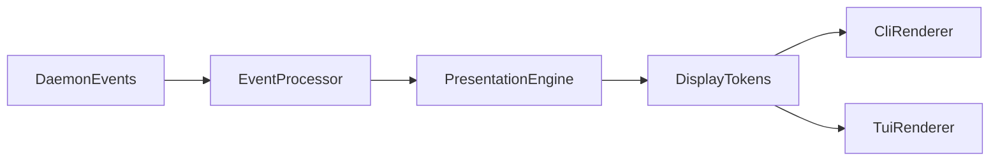

# RFC-502: Unified Presentation Engine

**Status**: Draft  
**Authors**: Soothe Team  
**Created**: 2026-04-02  
**Depends on**: `RFC-401-event-processing.md` (Event Processing), RFC-501 (Display & Verbosity), RFC-500 (CLI/TUI Architecture)  
**Kind**: Implementation Interface Design

---

## 1. Abstract

This RFC defines a unified `PresentationEngine` for CLI/TUI output decisions.
It centralizes presentation policy that was previously scattered across
EventProcessor, CLI stream pipeline, and renderers:

- reason-line compression (single concise line per reason event)
- de-duplication and rate limiting for progress updates
- noisy tool-result summarization
- icon-first presentation conventions

Renderers remain output transports, while `PresentationEngine` owns display
decision logic.

---

## 2. Motivation

Headless CLI output can become noisy due to:

1. Multiple near-identical reason lines per short interval.
2. Repeated progress updates for the same step.
3. Large structured tool payloads leaking directly into stderr/stdout.
4. Mixed responsibilities across processing and rendering modules.

The result is high cognitive load and hard-to-trust progress signals.

---

## 3. Scope

This RFC defines:

- `PresentationEngine` interface and state model.
- P0 and P1 policy rules for reason/progress/tool output.
- Integration boundary between EventProcessor, presentation, and renderers.

Non-goals:

- transport protocol changes (RFC-400)
- plan/goal execution semantics (RFC-200/200)
- event naming schema changes (RFC-400)

---

## 4. Core Contracts

### 4.1 PresentationState

Tracks dedup/rate-limit windows:

- `last_reason_key`
- `last_reason_at_s`
- `last_reason_by_step: dict[str, float]`

### 4.2 PresentationEngine

Required methods:

```python
class PresentationEngine:
    def should_emit_reason(self, *, content: str, step_id: str | None = None) -> bool: ...
    def summarize_tool_result(self, text: str) -> str: ...
```

---

## 5. P0 / P1 Policy Rules

### 5.1 P0 Rules (MUST)

1. `loop_agent.reason` MUST emit at most one display line per event.
2. Multi-step intermediate assistant body text MUST be suppressed in headless CLI.
3. Final answer MUST have a single output source (no synthetic replay).

### 5.2 P1 Rules (SHOULD)

1. Near-identical reason lines SHOULD be deduplicated in a short time window.
2. Same-step progress SHOULD be rate-limited unless status meaning changes.
3. Structured tool payloads SHOULD be summarized into compact one-line text.

---

## 6. Integration Architecture



Responsibilities:

- `EventProcessor`: normalize and route events/messages.
- `PresentationEngine`: decide visibility shape and suppression details.
- Renderer: write prepared display data to target surface.

---

## 7. Compatibility and Migration

Migration path:

1. Introduce `PresentationEngine` with reason dedup + tool summary first.
2. Route existing stream pipeline/reason handling through it.
3. Keep RendererProtocol stable; move strategy logic out of renderer over time.

No daemon protocol changes are required.

---

## 8. Acceptance Criteria

1. One reason line per reason event in normal verbosity.
2. No multi-step intermediate assistant body replay in stdout.
3. No direct long structured payload dump in default tool result output.
4. Existing unit and integration suites pass.

---

## 9. References

- RFC-400: Event Processing & Filtering
- RFC-501: Display & Verbosity
- RFC-500: CLI/TUI Architecture

