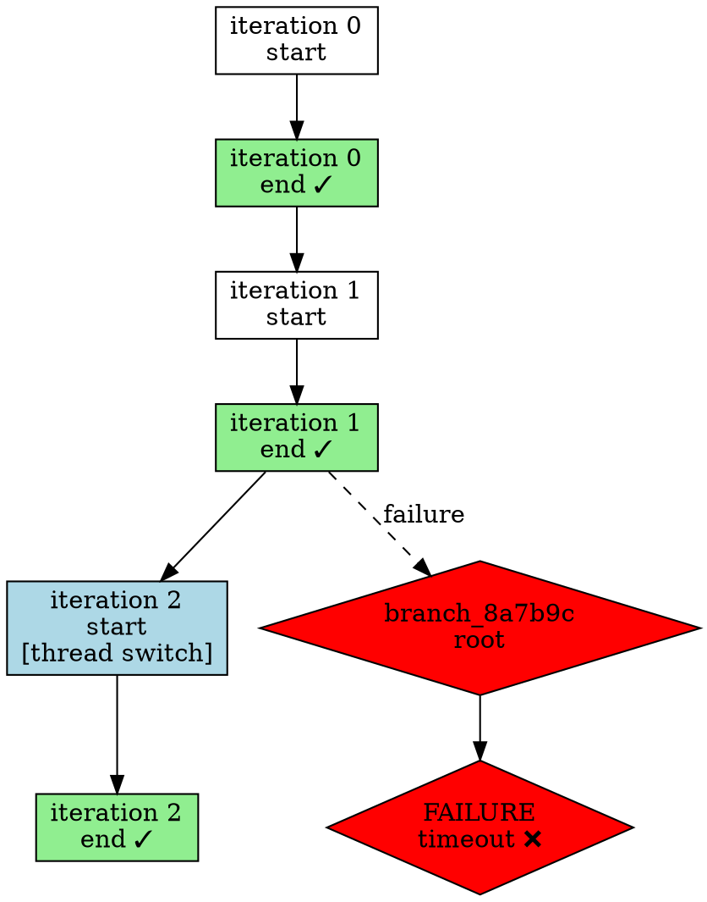

# Loop Management CLI Commands

> Design draft for loop-centric CLI commands for managing AgentLoop instances.
>
> **RFC Number**: RFC-504
> **Status**: Draft
> **Created**: 2026-04-22
> **Dependencies**: RFC-503 (Loop-First UX), RFC-611 (Checkpoint Tree), RFC-454 (Slash Commands)
> **Author**: Claude Sonnet 4.6

---

## Abstract

This RFC defines CLI commands for users to manage AgentLoop instances: list active loops, inspect loop details, visualize checkpoint trees (main line + failed branches), prune old branches, and delete loops. Commands provide loop-centric user interface aligned with RFC-612's loop-first user experience, replacing thread-based commands with loop-based commands.

---

## Motivation

### Current Problem

**Thread-centric commands** (current):
- `soothe thread list` - Lists threads
- `soothe thread describe <thread_id>` - Shows thread details
- `soothe thread delete <thread_id>` - Deletes thread
- Users manage threads, not loops

**Missing capabilities**:
- No checkpoint tree visualization
- No branch management (failed attempts invisible)
- No loop-level history inspection
- No pruning strategy for old branches

### Proposed Solution

**Loop-centric commands** (new):
- `soothe loop list` - Lists loops (replaces thread list)
- `soothe loop describe <loop_id>` - Shows loop details with checkpoint tree
- `soothe loop tree <loop_id>` - Visualizes checkpoint tree (NEW)
- `soothe loop prune <loop_id>` - Prunes old branches (NEW)
- `soothe loop delete <loop_id>` - Deletes loop (replaces thread delete)
- Users manage loops, threads are internal

**New capabilities**:
- Checkpoint tree visualization (main line + failed branches)
- Branch pruning strategy (cleanup old failed attempts)
- Loop-level history inspection (goals across all threads)
- Branch learning display (failure analysis + retry outcome)

---

## Command Structure

### Parent Command

```bash
soothe loop <subcommand>
```

### Subcommands

| Command | Description | Status |
|---------|-------------|--------|
| `list` | List all AgentLoop instances | REPLACES `thread list` |
| `describe <loop_id>` | Show detailed loop information | REPLACES `thread describe` |
| `tree <loop_id>` | Visualize checkpoint tree structure | NEW |
| `prune <loop_id>` | Prune old failed branches | NEW |
| `delete <loop_id>` | Delete loop entirely | REPLACES `thread delete` |
| `switch <loop_id>` | Switch to different loop | REPLACES `thread resume` |
| `new` | Create fresh loop | NEW |
| `status` | Quick status summary | NEW |

---

## Command 1: `soothe loop list`

### Syntax

```bash
soothe loop list [--status <status>] [--limit <N>]
```

### Options

| Option | Description | Default |
|--------|-------------|---------|
| `--status` | Filter by status | None (all statuses) |
| `--limit` | Limit number of results | 20 |

**Status values**: `running`, `ready_for_next_goal`, `finalized`, `cancelled`

---

### Output Format

```
Loop ID          Status              Threads    Goals    Switches    Created
─────────────────────────────────────────────────────────────────────────────
loop_abc123      ready_for_next_goal 3          5        2           2026-04-22 10:30
loop_def456      running             2          3        1           2026-04-22 14:15
loop_ghi789      finalized           5          10       4           2026-04-21 09:00
loop_jkl012      cancelled           1          2        0           2026-04-20 16:45
```

**Columns**:
- `Loop ID`: AgentLoop identifier (UUID)
- `Status`: Loop lifecycle status
- `Threads`: Number of threads (internal, shown for context)
- `Goals`: Goals completed
- `Switches`: Thread switches (internal)
- `Created`: Creation timestamp

---

### Implementation

```python
async def list_loops(status: str | None = None, limit: int = 20):
    """List all AgentLoop instances."""
    
    loops_dir = SOOTHE_HOME / "data" / "loops"
    loops = []
    
    for loop_dir in loops_dir.iterdir():
        if loop_dir.is_dir():
            metadata_file = loop_dir / "metadata.json"
            if metadata_file.exists():
                metadata = json.loads(metadata_file.read_text())
                
                # Filter by status
                if status and metadata.get("status") != status:
                    continue
                
                loops.append({
                    "loop_id": metadata["loop_id"],
                    "status": metadata["status"],
                    "threads": len(metadata["thread_ids"]),
                    "goals": metadata["total_goals_completed"],
                    "switches": metadata["total_thread_switches"],
                    "created": metadata["created_at"][:16],  # YYYY-MM-DD HH:MM
                })
    
    # Sort by created_at (most recent first)
    loops.sort(key=lambda x: x["created"], reverse=True)
    
    # Limit results
    loops = loops[:limit]
    
    # Render table
    console.print(Printer.table(
        title="AgentLoops",
        columns=["Loop ID", "Status", "Threads", "Goals", "Switches", "Created"],
        rows=[[l["loop_id"], l["status"], l["threads"], l["goals"], l["switches"], l["created"]] for l in loops],
    ))
```

---

## Command 2: `soothe loop describe`

### Syntax

```bash
soothe loop describe <loop_id> [--verbose]
```

### Options

| Option | Description |
|--------|-------------|
| `--verbose` | Show detailed branch analysis |

---

### Output Format (Normal)

```
Loop: loop_abc123
Status: ready_for_next_goal
Schema Version: 3.1

Threads:
  Current: thread_003
  Span: thread_001, thread_002, thread_003

Execution Summary:
  Total Goals: 5
  Total Thread Switches: 2
  Total Duration: 3h 15m
  Total Tokens: 125,430

Timeline:
  Created: 2026-04-22 10:30:00 UTC
  Updated: 2026-04-22 15:45:00 UTC

Failed Branches: 1
  branch_8a7b9c (iteration 3)
    Failure: Tool execution timeout (subagent_timeout)
    Analyzed: 2026-04-22 14:30:00 UTC
    Retry: iteration 4 (successful)

Checkpoint Anchors: 6
  iteration 0: checkpoint_abc (thread_001, start)
  iteration 0: checkpoint_def (thread_001, end)
  iteration 1: checkpoint_ghi (thread_001, start)
  iteration 1: checkpoint_jkl (thread_001, end)
  iteration 2: checkpoint_mno (thread_002, start)  [thread switch]
  iteration 2: checkpoint_pqr (thread_002, end)
```

---

### Output Format (Verbose)

**Verbose output includes full branch analysis**:

```
Failed Branch: branch_8a7b9c
  Root Checkpoint: checkpoint_ghi (iteration 1)
  Failure Checkpoint: checkpoint_xyz (iteration 3)
  Execution Path: checkpoint_ghi → checkpoint_jkl → checkpoint_mno → checkpoint_xyz
  
  Failure Insights:
    - Root cause: Subagent timeout after 30s (claude subagent)
    - Context: Large file analysis exceeded timeout threshold
    
  Avoid Patterns:
    - Do not use claude subagent for files > 500KB without streaming
    - Avoid sequential file reads in single iteration
    
  Suggested Adjustments:
    - Use streaming mode for large file analysis
    - Split file into chunks, analyze in parallel
    - Increase subagent timeout to 60s for file analysis tasks
  
  Retry Outcome: SUCCESS (iteration 4)
    Applied learning: Split file into 3 chunks, analyzed in parallel
    Duration: 2m 45s (vs 30s timeout in original)
```

---

### Implementation

```python
async def describe_loop(loop_id: str, verbose: bool = False):
    """Show detailed loop information."""
    
    loop_dir = SOOTHE_HOME / "data" / "loops" / loop_id
    
    if not loop_dir.exists():
        console.print(f"[error]Loop {loop_id} not found[/error]")
        return
    
    # Load metadata
    metadata = json.loads((loop_dir / "metadata.json").read_text())
    
    # Load checkpoint database
    persistence_manager = AgentLoopCheckpointPersistenceManager("sqlite", SOOTHE_HOME)
    checkpoint_tree = await persistence_manager.load_checkpoint_tree_ref(loop_id)
    
    # Render panels
    console.print(Panel(f"Loop: {loop_id}\nStatus: {metadata['status']}\nSchema: {metadata['schema_version']}", title="Overview"))
    console.print(Panel(f"Current: {metadata['current_thread_id']}\nSpan: {', '.join(metadata['thread_ids'])}", title="Threads"))
    console.print(Panel(f"Goals: {metadata['total_goals_completed']}\nSwitches: {metadata['total_thread_switches']}\nDuration: {format_duration(metadata.get('total_duration_ms', 0))}\nTokens: {format_tokens(metadata.get('total_tokens_used', 0))}", title="Execution"))
    
    # Failed branches
    branches = checkpoint_tree.failed_branches
    console.print(Panel(f"Failed Branches: {len(branches)}\n" + format_branch_summary(branches), title="Branches"))
    
    if verbose:
        # Detailed branch analysis
        for branch_id, branch in branches.items():
            console.print(Panel(format_branch_details(branch), title=f"Branch: {branch_id}", style="error"))
    
    # Checkpoint anchors
    anchors = await persistence_manager.get_checkpoint_anchors_for_range(loop_id, 0, 1000)
    console.print(Panel(format_anchor_summary(anchors), title="Anchors"))
```

---

## Command 3: `soothe loop tree`

### Syntax

```bash
soothe loop tree <loop_id> [--format <ascii|json|dot>]
```

### Options

| Option | Description | Default |
|--------|-------------|---------|
| `--format` | Visualization format | `ascii` |

**Format values**:
- `ascii` - ASCII tree visualization (default)
- `json` - JSON structure (for programmatic access)
- `dot` - Graphviz DOT format (for graph rendering)

---

### ASCII Format Output

```
Main Execution Line:
  iteration 0 (thread_001)
    ├─ checkpoint_abc [start]
    ├─ Tool: execute(ls)
    ├─ Tool: execute(read_file)
    └─ checkpoint_def [end] ✓
  
  iteration 1 (thread_001)
    ├─ checkpoint_ghi [start]
    ├─ Reason: Analyze file structure
    ├─ Tool: execute(grep)
    └─ checkpoint_jkl [end] ✓
  
  iteration 2 (thread_002)  ← Thread switch (message history threshold)
    ├─ checkpoint_mno [start]
    ├─ Reason: Plan next goal
    ├─ Tool: subagent(claude, analyze_large_file)
    └─ checkpoint_pqr [end] ✓

Failed Branches:
  branch_8a7b9c (iteration 3, thread_001)
    ├─ checkpoint_ghi [root] ← Rewind point
    ├─ checkpoint_jkl
    ├─ checkpoint_mno
    ├─ Tool: subagent(claude, analyze_file) → TIMEOUT ❌
    └─ checkpoint_xyz [failure]
    
    Learning Applied (iteration 4):
      ├─ checkpoint_retry_start [root: checkpoint_ghi]
      ├─ Tool: subagent(claude, analyze_file_chunk_1) ✓
      ├─ Tool: subagent(claude, analyze_file_chunk_2) ✓
      ├─ Tool: subagent(claude, analyze_file_chunk_3) ✓
      └─ checkpoint_retry_end ✓
```

---

### JSON Format Output

```json
{
  "loop_id": "loop_abc123",
  "main_line": [
    {
      "iteration": 0,
      "thread_id": "thread_001",
      "start_checkpoint": "checkpoint_abc",
      "end_checkpoint": "checkpoint_def",
      "status": "success",
      "tools": ["execute(ls)", "execute(read_file)"]
    },
    {
      "iteration": 1,
      "thread_id": "thread_001",
      "start_checkpoint": "checkpoint_ghi",
      "end_checkpoint": "checkpoint_jkl",
      "status": "success",
      "tools": ["execute(grep)"],
      "reasoning": "Analyze file structure"
    },
    {
      "iteration": 2,
      "thread_id": "thread_002",
      "start_checkpoint": "checkpoint_mno",
      "end_checkpoint": "checkpoint_pqr",
      "status": "success",
      "thread_switch": true,
      "switch_reason": "message_history_threshold"
    }
  ],
  "failed_branches": [
    {
      "branch_id": "branch_8a7b9c",
      "iteration": 3,
      "thread_id": "thread_001",
      "root_checkpoint": "checkpoint_ghi",
      "failure_checkpoint": "checkpoint_xyz",
      "failure_reason": "Tool execution timeout",
      "execution_path": ["checkpoint_ghi", "checkpoint_jkl", "checkpoint_mno", "checkpoint_xyz"],
      "retry": {
        "iteration": 4,
        "applied_learning": ["Split file into chunks", "Parallel analysis"],
        "outcome": "success"
      }
    }
  ]
}
```

---

### DOT Format Output



---

### Implementation

```python
async def visualize_loop_tree(loop_id: str, format: str = "ascii"):
    """Visualize checkpoint tree structure."""
    
    persistence_manager = AgentLoopCheckpointPersistenceManager("sqlite", SOOTHE_HOME)
    checkpoint_tree = await persistence_manager.load_checkpoint_tree_ref(loop_id)
    
    if format == "ascii":
        render_ascii_tree(checkpoint_tree)
    elif format == "json":
        render_json_tree(checkpoint_tree)
    elif format == "dot":
        render_dot_tree(checkpoint_tree)
    else:
        console.print(f"[error]Unknown format: {format}[/error]")


def render_ascii_tree(tree: CoreAgentCheckpointTreeRef):
    """Render ASCII tree visualization."""
    
    console.print("[bold]Main Execution Line:[/bold]")
    
    for iteration in sorted(tree.main_line_checkpoints.keys()):
        checkpoint_id = tree.main_line_checkpoints[iteration]
        anchor = get_anchor_details(iteration, checkpoint_id)
        
        console.print(f"  iteration {iteration} ({anchor['thread_id']})")
        console.print(f"    ├─ {anchor['start_checkpoint']} [start]")
        
        for tool in anchor.get('tools_executed', []):
            console.print(f"    ├─ Tool: {tool}")
        
        console.print(f"    └─ {anchor['end_checkpoint']} [end] ✓")
    
    console.print("\n[bold]Failed Branches:[/bold]")
    
    for branch_id, branch in tree.failed_branches.items():
        console.print(f"  {branch_id} (iteration {branch.iteration}, {branch.thread_id})")
        console.print(f"    ├─ {branch.root_checkpoint_id} [root] ← Rewind point")
        
        for checkpoint in branch.execution_path[1:-1]:
            console.print(f"    ├─ {checkpoint}")
        
        console.print(f"    └─ {branch.failure_checkpoint_id} [failure] ❌")
        
        # Check retry outcome
        retry = find_retry_for_branch(branch_id)
        if retry:
            console.print(f"\n    Learning Applied (iteration {retry.iteration}):")
            console.print(f"      ├─ {retry.start_checkpoint} [root: {branch.root_checkpoint_id}]")
            for tool in retry.tools:
                console.print(f"      ├─ Tool: {tool} ✓")
            console.print(f"      └─ {retry.end_checkpoint} ✓")
```

---

## Command 4: `soothe loop prune`

### Syntax

```bash
soothe loop prune <loop_id> [--retention-days <N>] [--dry-run]
```

### Options

| Option | Description | Default |
|--------|-------------|---------|
| `--retention-days` | Keep branches created within this period | 30 |
| `--dry-run` | Show what would be pruned without pruning | False |

---

### Output Format

```
Pruning failed branches for loop_abc123:
  Retention: 30 days (threshold: 2026-03-22)

Found 2 old branches:
  branch_5d6e7f (created: 2026-03-15) - 37 days old
    Status: analyzed, retry successful
    Action: [PRUNE]
  
  branch_9g0h1i (created: 2026-03-20) - 32 days old
    Status: analyzed, no retry
    Action: [PRUNE]

Summary:
  Branches pruned: 2
  Space recovered: ~1.2MB
  Remaining branches: 3
```

**Dry-run output**:
```
Dry-run: would prune 2 branches (no changes made)
  branch_5d6e7f - 37 days old
  branch_9g0h1i - 32 days old
```

---

### Implementation

```python
async def prune_loop_branches(loop_id: str, retention_days: int = 30, dry_run: bool = False):
    """Prune old failed branches."""
    
    persistence_manager = AgentLoopCheckpointPersistenceManager("sqlite", SOOTHE_HOME)
    threshold = datetime.now(UTC) - timedelta(days=retention_days)
    
    console.print(f"Pruning failed branches for {loop_id}:")
    console.print(f"  Retention: {retention_days} days (threshold: {threshold.date()})")
    
    if dry_run:
        branches = await persistence_manager.get_failed_branches_for_loop(loop_id)
        old_branches = [b for b in branches if b.created_at < threshold and not b.pruned_at]
        
        console.print(f"\nDry-run: would prune {len(old_branches)} branches (no changes made)")
        for branch in old_branches:
            age_days = (datetime.now(UTC) - branch.created_at).days
            console.print(f"  {branch.branch_id} - {age_days} days old")
    else:
        count = await persistence_manager.prune_old_branches(loop_id, retention_days)
        console.print(f"\nSummary:")
        console.print(f"  Branches pruned: {count}")
        console.print(f"  Remaining: {len(await persistence_manager.get_failed_branches_for_loop(loop_id))}")
```

---

## Command 5: `soothe loop delete`

### Syntax

```bash
soothe loop delete <loop_id> [--force]
```

### Options

| Option | Description |
|--------|-------------|
| `--force` | Delete without confirmation (dangerous) |

---

### Output Format

```
Warning: This will permanently delete loop_abc123 and all associated data:
  - 3 thread checkpoints (thread_001, thread_002, thread_003)
  - 5 goal execution records
  - 1 failed branch history
  - Working memory spills

Are you sure? [y/N]: y

Deleted loop_abc123:
  Removed checkpoint database
  Removed metadata
  Removed working memory spills
  Preserved thread checkpoints (run `soothe thread delete` to remove)
```

---

### Implementation

```python
async def delete_loop(loop_id: str, force: bool = False):
    """Delete loop with confirmation."""
    
    loop_dir = SOOTHE_HOME / "data" / "loops" / loop_id
    
    if not loop_dir.exists():
        console.print(f"[error]Loop {loop_id} not found[/error]")
        return
    
    # Load metadata for confirmation
    metadata = json.loads((loop_dir / "metadata.json").read_text())
    
    if not force:
        console.print(f"[warning]Warning: This will permanently delete {loop_id} and all associated data:[/warning]")
        console.print(f"  - {len(metadata['thread_ids'])} thread checkpoints ({', '.join(metadata['thread_ids'])})")
        console.print(f"  - {metadata['total_goals_completed']} goal execution records")
        console.print(f"  - {len(metadata.get('failed_branches', []))} failed branch history")
        console.print(f"  - Working memory spills")
        
        confirm = Prompt.ask("Are you sure?", choices=["y", "N"], default="N")
        if confirm != "y":
            console.print("Cancelled.")
            return
    
    # Delete loop directory
    shutil.rmtree(loop_dir)
    
    console.print(f"[success]Deleted {loop_id}:[/success]")
    console.print("  Removed checkpoint database")
    console.print("  Removed metadata")
    console.print("  Removed working memory spills")
    console.print("  Preserved thread checkpoints (run `soothe thread delete` to remove)")
```

---

## Integration with CLI Main

### Registration

```python
# soothe_cli/main.py

app = typer.Typer()

# Loop management commands
loop_app = typer.Typer(help="Manage AgentLoop instances")
app.add_typer(loop_app, name="loop")

loop_app.command("list")(list_loops)
loop_app.command("describe")(describe_loop)
loop_app.command("tree")(visualize_loop_tree)
loop_app.command("prune")(prune_loop_branches)
loop_app.command("delete")(delete_loop)
loop_app.command("switch")(switch_loop)
loop_app.command("new")(create_new_loop)
loop_app.command("status")(show_loop_status)
```

---

## Implementation Tasks

### Phase 1: Basic Commands
- Implement `list_loops()` command
- Implement `describe_loop()` command (normal output)
- Implement `delete_loop()` command with confirmation

### Phase 2: Visualization
- Implement `visualize_loop_tree()` (ASCII format)
- Implement `visualize_loop_tree()` (JSON format)
- Implement `visualize_loop_tree()` (DOT format)

### Phase 3: Advanced Features
- Implement `describe_loop()` verbose output (branch analysis)
- Implement `prune_loop_branches()` with dry-run
- Implement retention policy logic

### Phase 4: Integration
- Register commands in CLI main
- Add help text and examples
- Integrate with persistence manager

---

## Success Criteria

1. Loop commands work (list, describe, tree, prune, delete) ✓
2. Thread commands removed (thread list, describe, delete) ✓
3. Tree visualization works (ASCII, JSON, DOT) ✓
4. Branch analysis displayed in verbose mode ✓
5. Pruning works with retention policy ✓
6. Delete requires confirmation (unless --force) ✓
7. Commands integrated with CLI main ✓
8. Thread checkpoints preserved on loop delete ✓

---

## Related Specifications

- RFC-612: Loop-First User Experience
- RFC-611: AgentLoop Checkpoint Tree Architecture
- RFC-409: AgentLoop Persistence Backend
- RFC-454: Slash Command Architecture

---

**End of RFC-615 Draft**