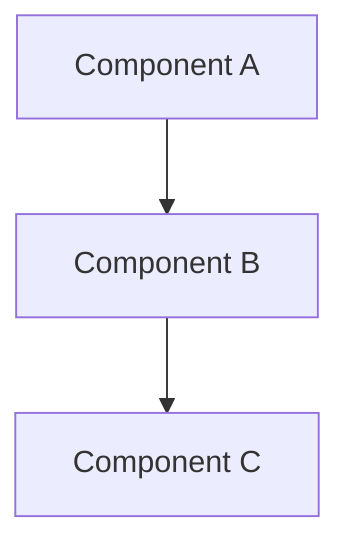

# Architecture Design Template

**RFC**: RFC-XXXX  
**Title**: [System/Subsystem] Architecture Design  
**Status**: Draft  
**Kind**: Architecture Design  
**Created**: YYYY-MM-DD  
**Dependencies**: RFC-000, [other Conceptual Design RFCs]

## Overview

[High-level summary of the architecture]

## Motivation

[Why is this architecture needed? What problems does it solve?]

## Guiding Principles

[Architectural principles]

1. **Principle 1**: [Description]
2. **Principle 2**: [Description]

## Component Overview

[High-level diagram or description of components]



## Component Responsibilities

### Component A

**Purpose**: [What is this component's responsibility?]

**Capabilities**:
- [Capability 1]
- [Capability 2]

**Interfaces**:
- Provides: [Interface A]
- Requires: [Interface B]

### Component B

**Purpose**: [What is this component's responsibility?]

**Capabilities**:
- [Capability 1]
- [Capability 2]

**Interfaces**:
- Provides: [Interface C]
- Requires: [Interface A]

## Data Flow

[How data moves through the system]

### Flow 1: [Name]

1. Step 1: [Description]
2. Step 2: [Description]
3. Step 3: [Description]

## Architectural Constraints

[Key constraints and decisions]

1. **Constraint 1**: [Description and rationale]
2. **Constraint 2**: [Description and rationale]

## Layer Architecture

[If applicable]

### Layer 1: [Name]

**Responsibility**: [What layer is responsible for]

**Contains**: [Types of components in this layer]

## Abstract Schemas

[High-level data models without implementation details]

### Schema 1: [Name]

```
Entity {
  id: ID
  name: Name
  relationships: Relationship[]
}
```

## Integration Points

[How this system integrates with external systems]

### External System A

**Integration Type**: [API, Event, File, etc.]

**Data Exchange**: [What data is exchanged]

## Related Documents

- [RFC Standard](./rfc-standard.md)
- [RFC Index](./rfc-index.md)
- [RFC-000](./RFC-000-system-conceptual-design.md) - Conceptual Design
- [Related RFC-XXXX](./RFC-XXXX.md)

---

*Template generated by platonic-init*
